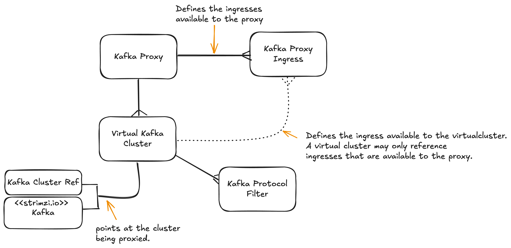

# Proposal 001 - Kroxylicious Operator API (v1alpha)

<!-- TOC -->
* [Kroxylicious Operator API - v1alpha](#kroxylicious-operator-api---v1alpha)
* [Background](#background)
* [CRDs](#crds)
* [Personas / Responsibilities](#personas--responsibilities)
  * [Infrastructure admin](#infrastructure-admin)
  * [Developer](#developer)
* [API](#api)
  * [KafkaProxy](#kafkaproxy)
  * [KafkaProxyIngress](#kafkaproxyingress)
  * [VirtualKafkaCluster](#virtualkafkacluster)
  * [KafkaProtocolFilter](#kafkaprotocolfilter)
  * [KafkaClusterRef](#kafkaclusterref)
* [Worked examples](#worked-examples)
  * [On Cluster Traffic - plain downstream & upstream](#on-cluster-traffic---plain-downstream--upstream)
  * [On Cluster Traffic - tls downstream & upstream](#on-cluster-traffic---tls-downstream--upstream)
    * [On Cluster Traffic - tls downstream & upstream - variation using OpenShift Cluster CA generated cert](#on-cluster-traffic---tls-downstream--upstream---variation-using-openshift-cluster-ca-generated-cert)
  * [Off Cluster Traffic (OpenShift Route)](#off-cluster-traffic-openshift-route)
  * [Off Cluster Traffic (Load Balancer)](#off-cluster-traffic-load-balancer)
  * [Upstream specified by Kafka CR](#upstream-specified-by-kafka-cr)
* [Phased High Level Implementation Plan](#phased-high-level-implementation-plan)
* [Not in Scope](#not-in-scope)
<!-- TOC -->
# Background

Keith isn't sure that '[Gateway API flavoured approach](https://github.com/kroxylicious/design/pull/52)' for modelling
ingress is the right one for Kroxylicious Operator. He thinks that our ingress API should work with Gateway APIs, rather than be one itself.  So, this 
has prompted him to think about an alternative API design.

# CRDs

* KafkaProxy CR - an instance of the Kroxylicious
* KafkaProxyIngress CR - Defines a way to access a KafkaProxy
* VirtualKafkaCluster CR - a virtual cluster
* KafkaProtocolFilter CR - a filter definition
* KafkaClusterRef CR - a reference to a kafka cluster



https://excalidraw.com/#json=-vRYOfY9P3yzBNwzR9hu0,va3843kZ6Z2XCoR9wdgWrg


# Personas / Responsibilities

## Infrastructure admin

Responsible for the proxy tier and how proxies are exposed to the network.

## Developer

Responsible for the configuration of the virtualcluster and filters.
Responsible for providing the virtualcluster TLS key/trust material (in Secret and ConfigMap respectively).
Responsible for providing any key/trust material required to connect to the target cluster (in Secret and ConfigMap respectively).

# API

## KafkaProxy

The KafkaProxy CR is the responsibility of the Infrastructure admin.

Declares an instance of the proxy and defines the ingress mechanisms available to it.

```yaml
apiVersion: kroxylicious.io/v1alpha1
kind: KafkaProxy
metadata:
  name: myproxy
spec:

   # Optional - controls the KafkaProxy infrastructure.
   infrastructure:
      # Influences the annotations and labels on all resources created by the operator.
      annotations:
         x: y
      labels:
         x: y
      proxy:
        # Controls specific to operand deployment
        replicas: 2
        resources:
          requests:
            memory: "64Mi"
            cpu: "250m"
#  # Optional: default ordered list of filters to be used by a virtualcluster that doesn't apply it own.  (this doesn't fit well with the Infra role - drop it?).
#  defaultFilterRefs:
#  - group: filter.kroxylicious.io
#    kind: KafkaProtocolFilter
#    name: encryption```

status:
   # status of the proxy tbd
   conditions:
   - status: x
     type: y
     reason: r
   # per listener status 
   ingresses:
   - name: myclusterip
     conditions:
     - ...
```

## KafkaProxyIngress

The KafkaProxyIngress CR is the responsibility of the Infrastructure admin.

It declares a named ingress mechanism - in other words, a way for traffic to get to a proxy.  KafkaProxyIngress knows about four types:

* clusterIP - for on-cluster traffic realised using Kubernetes ClusterIP Service. Supports TCP or TLS.
* loadBalancer - for off-cluster realised using a Kubernetes LoadBalancer Service.  Supports TLS only.
* openShiftRoute - for off-cluster realised using OpenShift Routes (OpenShift specific)
* gateway - for off-cluster realised using Gateway API.  Supports `TLSRoutes` with listener type of `passthrough`.

```yaml
apiVersion: kroxylicious.io/v1alpha1
kind: KafkaProxyIngress
metadata:
  name: myclusterip
spec:
  # reference to the proxy that will use this ingress.
  proxyRef:
    kind: KafkaProxy  # if present must be Gateway, otherwise defaulted
    group: kroxylicious.io # if present must be proxy.kroxylicious, otherwise defaulted=
    name: myproxy  # name of proxy

  # oneOf: clusterIP, loadBalancer, openShiftRoute, gateway
  clusterIP:
    protocol: TCP|TLS (ClusterIP supports both)
    port: # optional, defaults to 9082
  loadBalancer:
    bootstrapAddressPattern: $(vitrtualClusterName).kafka.com 
    brokerAddressPattern: broker-$(nodeId).$(vitrtualClusterName).kafka.com
    port: # optional, defaults to 9082
  openShiftRoute:
    # ingress controller name (optional, if omitted defaults to default in the openshift-ingress-operator namespace).
    resourceRef:
      kind: IngressController  # if present must be IngressController, otherwise defaulted to IngressController
      group: operator.openshift.io # if present must be operator.openshift.io, otherwise defaulted to operator.openshift.io
      name: myingresscontroller
      namespace: openshift-ingress-operator # namespace of the gateway, if omitted assumes namespace of this resource
  gateway:
    type: TLSRoute
    resourceRef:
      kind: Gateway  # if present must be Gateway, otherwise defaulted to Gateway
      group: gateway.networking.k8s.io # if present must be gateway.networking.k8s.io, otherwise defaulted to gateway.networking.k8s.io
      name: foo-gateway  # name of gateway resource to be used
      namespace: namespace # namespace of the gateway, if omitted assumes namespace of this resource
      sectionName: mytlspassthrough # refers to a TLS passthrough listener defined in the Gateway

  # Optional
  infrastructure:
    # Controls the Admin influence the annotations/labels created on the ingress objects (Service, OpenShift Routes, TLSRoutes etc).
    # This lets the Infrastructure admin  specify things like:
    # https://kubernetes-sigs.github.io/aws-load-balancer-controller/v2.2/guide/service/annotations/#lb-type
    annotations:
       x: y
    labels:
       x: y

   # Optional - provides tls configuration.  Does not provide key material
  tls:
    protocols:
      allowed: [TLSv1.3,  TLSv1.2]
    cipherSuites:
      denied: [TLS_ECDHE_ECDSA_WITH_AES_256_CCM]
status:
   # describes the validity state of the ingress.  For instance:
   # - for openShiftRoute the operator will verify that the ingress controller exists.
   # - for gateway, it will verify that the gateway exists and the listener is defined as TLS passthrough.
   conditions:
   - status: x
     type: y
     reason: r 
```      

## VirtualKafkaCluster

The VirtualKafkaCluster CR is the responsibility of the Developer.

Declares a virtualcluster.

A Virtualcluster is associated with exactly one KafkaProxy.

It enumerates the ingresses that are to be used by the virtualcluster.  It also supplies the virtual cluster ingress specific information
such as the TLS certificates.

The virtualcluster has a reference to a single target cluster which may be expressed using either a reference to a Strimzi Kafka object, or generic bootstraping information.

```yaml
apiVersion: kroxylicious.io/v1alpha1
kind: VirtualKafkaCluster
metadata:
  name: mycluster
spec:
  proxyRef:
    kind: KafkaProxy  # if present must be KafkaProxy, otherwise defaulted
    group: kroxylicious.io # if present must be kroxylicious.io, otherwise defaulted
    name: myproxy
 
  # list of ingresses the virtual cluster wishes to use.  Each ingress selected must be one associated with
  # the proxy.  It is legal for the virtualcluster to choose only a subset.
  ingresses:
  - name: myclusterip
    tls:
      # server certificate - initial implementation will permit at most one entry in the array. keystore needs to contain a certficate for bootstrap and brokers.  It might be a single certificate with SANs matching all, or keystore with a certificate per host.  We'll rely on sun.security.ssl.X509KeyManagerImpl.CheckType#check to select the most appropiate cert.
      # secrets provided by the Developer.
      certificateRefs:
      - kind: Secret # if present must be Secret, otherwise defaulted to Secret
        group: ""  # if present must be "", otherwise defaulted to ""
        name: servercert
        namespace: # namespace of the secret, if omitted assumes namespace of this resource
      # peer trust
      # configMap provided by the Developer
      trustAnchorRefs:
      - kind: ConfigMap # if present must be ConfigMap, otherwise defaulted to ConfigMap
        group: ""  # if present must be "", otherwise defaulted to ""
        name: trustbundle
        namespace: # namespace of the configmap, if omitted assumes namespace of this resource
      trustOptions:
       clientAuth: REQUIRED
    infrastructure:
      # Controls that let the Developer influence the annotations/labels created on the ingress objects (Service, OpenShift Routes, TLSRoutes etc).
      # If an annotation or label supplied here duplicates one provided by the KafkaProxyIngress, the one defined by the KafkaProxyIngress takes precendence. 
      # The specific use case for this is https://docs.openshift.com/container-platform/4.17/security/certificates/service-serving-certificate.html#add-service-certificate_service-serving-certificate
      # where the developer wishes their VC to use Certificates created by OpenShift (useful for ClusterIP type TLS).
      annotations:
         x: y
      labels:
         x: y

  # Points to the cluster being proxied.  Can either be Strimzi Kafka resource or endpoint details.
  targetCluster:
    clusterRef:
      group: strimzi.io|kroxylicious.io # must be strimzi.io or kroxylicious.io
      kind: Kafka|KafkaClusterRef  # must be Kafka (belonging to group strimzi.io) or TargetClusterRef (belonging to group kroxylicious.io)
      name: my-cluster
      listenerName: listener # name of strimzi listener, permitted only for Kafka (group strimzi.io).  (Optional)
    tls:
      # Optional - client auth certificate
      # secret provided by the Developer.
      certificateRef:
        kind: Secret # if present must be Secret, otherwise defaulted to Secret
        group: ""  # if present must be "", otherwise defaulted to ""
        name: clientcert
        namespace: # namespace of the secret, if omitted assumes namespace of this resource

  # ordered list of filters to be used by the virtualcluster
  filterRefs:
  - group: filter.kroxylicious.io
    kind: KafkaProtocolFilter
    name: encryption
status:
   # overall status
   conditions:
   - status: x
     type: y
     reason: r 
   # per ingress status 
   ingresses:
   - name: myclusterip
     bootstrap: xxx.local:9082   # the bootstrap address
     protocol: TCP|TLS
     conditions:
     - ...
   # per filter status 
   filters:
   - name: myclusterip
     conditions:
     - ...
```

## KafkaProtocolFilter

The VirtualKafkaCluster CR is the responsibility of the Developer - As per current implementation.

```yaml
apiVersion: filter.kroxylicious.io/v1alpha1
kind: KafkaProtocolFilter
metadata:
  name: myfilter
spec:
  type: io.kroxylicious.filter.encryption.RecordEncryption
  config:
    kms: Foo
    kmsConfig: {}
    selector: Bar
    selectorConfig: {}
```

## KafkaClusterRef

KafkaClusterRef points to a Kafka cluster. It might be a Kafka cluster stood up on the same Kubernetes cluster, a cluster
running on a remote Kafka cluster, it might be service running on bare metal, or a Kafka service of a Cloud Provider.

The KafkaClusterRef CR may the responsibility of a Developer or the Infrastructure admin.

The KafkaClusterRef is a spec only resource.  It may be referenced by many VirtualCluster belonging to the same Proxy, or
VirtualClusters belonging to different proxies.

```yaml
apiVersion: kroxylicious.io/v1alpha1
kind: KafkaClusterRef
metadata:
  name: mycluster
spec:
   bootstrap: bootstrap:9092
   protocol: TCP|TLS
   nodeIdRanges:
   - name: range1
     start: 0
     end: 3
   tls:
    # Optional - peer trust
    # configMap provided by the Developer or the Infrastructure admin
    trustAnchorRefs:
      - kind: ConfigMap # if present must be ConfigMap, otherwise defaulted to ConfigMap
        group: ""  # if present must be "", otherwise defaulted to ""
        name: trustbundle
        namespace: # namespace of the configmap, if omitted assumes namespace of this resource
    protocols:
      allowed: [TLSv1.3,  TLSv1.2]
    cipherSuites:
      denied: [TLS_ECDHE_ECDSA_WITH_AES_256_CCM]
```

# Worked examples

## On Cluster Traffic - plain downstream & upstream

```yaml
apiVersion: kroxylicious.io/v1alpha1
kind: KafkaProxy
metadata:
  name: myproxy
spec: {}
```

```yaml
apiVersion: kroxylicious.io/v1alpha1
kind: KafkaProxyIngress
metadata:
  name: myclusterip
spec:
  proxyRef:
    name: myproxy
  clusterIP:
    protocol: TCP
    port: 9082
```

```yaml
apiVersion: kroxylicious.io/v1alpha1
kind: VirtualKafkaCluster
metadata:
  name: mycluster
spec:
  proxyRef:
    name: myproxy
    kind: KafkaProxy
    group: kroxylicious.io

  ingress:
  - name: myclusterip

  targetCluster:
    clusterRef:
      name: mytargetcluster

  filterRefs:
  - group: filter.kroxylicious.io
    kind: KafkaProtocolFilter
    name: encryption 
```

```yaml
apiVersion: kroxylicious.io/v1alpha1
kind: KafkaClusterRef
metadata:
  name: mytargetcluster
spec:
  bootstrap: upstream:9092
  protocol: TCP
  nodeIdRanges:
    - name: mybrokers
      range:
        startInclusive: 0
        endExclusive: 3
```

What would operator create:
* kroxylicious deployment, 1 replica
* proxy relies on port based routing (needs new PortPerNode scheme that allows the Operator to control the ports precisely.  This is needed to prevent the potential for "crossed-lines" during reconcilations.)
* 1 ClusterIP services (with n+1 ports) - operator needs to _deterministically_ assign a block of ports for this VC and create the port/target mapping in the Service accordingly.
* Kafka Clients connect to serviceaddress:9082 

## On Cluster Traffic - tls downstream & upstream

```yaml
apiVersion: kroxylicious.io/v1alpha1
kind: KafkaProxy
metadata:
  name: myproxy
spec: {}
```

```yaml
apiVersion: kroxylicious.io/v1alpha1
kind: KafkaProxyIngress
metadata:
  name: oncluster
spec:
  proxyRef:
    name: myproxy

  clusterIP:
    protocol: TLS
    port: 9082
```

```yaml
apiVersion: kroxylicious.io/v1alpha1
kind: VirtualKafkaCluster
metadata:
  name: mycluster
spec:
  proxyRef:
    name: myproxy
    kind: KafkaProxy
    group: kroxylicious.io

  ingress:
  - name: myclusterip
    tls:
      certificateRef:
         ...

  targetCluster:
    clusterRef:
      name: mytargetcluster

  filterRefs:
  - group: filter.kroxylicious.io
    kind: KafkaProtocolFilter
    name: encryption 
```

```yaml
apiVersion: kroxylicious.io/v1alpha1
kind: KafkaClusterRef
metadata:
  name: mytargetcluster
spec:
  bootstrap: upstream:9092
  protocol: TLS
  nodeIdRanges:
    - name: mybrokers
      range:
        startInclusive: 0
        endExclusive: 3
```

What the Developer would provide:
* secret containing server certificate to be used by the virtual cluster.  SAN name would need to match the service that will be created by the Operator (documentation required).

What would operator create:
* kroxylicious deployment, 1 replica
* proxy relies on port based routing  (needs new PortPerNode scheme that allows the Operator to control the ports precisely.  This is needed to prevent the potential for "crossed-lines" during reconcilations.)
* 1 ClusterIP services (with n+1 ports) - operator needs to _deterministically_ assign a block of ports for this VC and create the port/target mapping in the Service accordingly.
* Kafka Clients connect to serviceaddress:9082 


### On Cluster Traffic - tls downstream & upstream - variation using OpenShift Cluster CA generated cert

KafkaProxy and KafkaProxyIngress as above

```yaml
apiVersion: kroxylicious.io/v1alpha1
kind: VirtualKafkaCluster
metadata:
  name: mycluster
spec:
  proxyRef:
     ...

  ingress:
  - name: myclusterip
    infrastructure:
       annotations:
         service.beta.openshift.io/serving-cert-secret-name=myservingcert   # Tells openshift to generate a secret
    tls:
      certificateRefs:
      - name: myservingcert
  targetCluster:
     ...

  filterRefs:
     ...
```

What the Developer would provide:
(nothing - openshift is generating the serving cert for us and providing DNS)

What would operator create:
(as above)


## Off Cluster Traffic (OpenShift Route)

```yaml
apiVersion: kroxylicious.io/v1alpha1
kind: KafkaProxy
metadata:
  name: myproxy
spec: {}
```

```yaml
apiVersion: kroxylicious.io/v1alpha1
kind: KafkaProxyIngress
metadata:
  name: myopenshiftroute
spec:
  proxyRef:
    name: myproxy

  openShiftRoute: {}
```

```yaml
apiVersion: kroxylicious.io/v1alpha1
kind: VirtualKafkaCluster
metadata:
  name: mycluster
spec:
  proxyRef:
    name: myproxy
    kind: KafkaProxy
    group: kroxylicious.io

  ingress:
  - name: myopenshiftroute
    tls:
      certificateRef:
         ...

  targetCluster:
    clusterRef:
      name: mytargetcluster

  filterRefs:
  - group: filter.kroxylicious.io
    kind: KafkaProtocolFilter
    name: encryption 
```

```yaml
apiVersion: kroxylicious.io/v1alpha1
kind: KafkaClusterRef
metadata:
  name: mytargetcluster
spec:
  bootstrap: upstream:9092
  protocol: TLS
  nodeIdRanges:
    - name: mybrokers
      range:
        startInclusive: 0
        endExclusive: 3
```

What the Developer would provide:
* secret containing server certificate with SAN names matching the hostnames applied to the routes

What would operator create:
* kroxylicious deployment, 1 replica
* proxy relies on SNI based routing (use SNI scheme)
* ClusterIP service called `myopenshiftroute-service` (shared)
* n+1 OpenShift Routes configured for pass-through. The `to` points to the `myopenshiftroute-service`.

Note: that the operator would write the virtualcluster proxy config based on the hostnames assigned to the Routes by the Ingress Controller.


## Off Cluster Traffic (Load Balancer)

```yaml
apiVersion: kroxylicious.io/v1alpha1
kind: KafkaProxy
metadata:
  name: myproxy
spec: {}
```

```yaml
apiVersion: kroxylicious.io/v1alpha1
kind: KafkaProxyIngress
metadata:
  name: myloadbalancer
spec:
  proxyRef:
    name: myproxy

  loadBalancer:
    bootstrapAddressPattern: $(vitrtualClusterName).kafka.com 
    brokerAddressPattern: broker-$(nodeId).$(vitrtualClusterName).kafka.com
    port: 9082
```

```yaml
apiVersion: kroxylicious.io/v1alpha1
kind: VirtualKafkaCluster
metadata:
  name: mycluster
spec:
  proxyRef:
    name: myproxy
    kind: KafkaProxy
    group: kroxylicious.io

  ingress:
  - name: myloadbalancer
    tls:
      certificateRef:
         ...

  targetCluster:
    clusterRef:
      name: mytargetcluster

  filterRefs:
  - group: filter.kroxylicious.io
    kind: KafkaProtocolFilter
    name: encryption 
```

```yaml
apiVersion: kroxylicious.io/v1alpha1
kind: KafkaClusterRef
metadata:
  name: mytargetcluster
spec:
  bootstrap: upstream:9092
  protocol: TLS
  nodeIdRanges:
    - name: mybrokers
      range:
        startInclusive: 0
        endExclusive: 3
```

What Developer would provide:

* DNS configuration that resolves the virtual clusters names to the service's assigned ClusterIP.
* secret containing server certificate with SAN names matching the hostnames applied to the routes

What would operator create:
* kroxylicious deployment, 1 replica
* proxy relies on SNI based routing (use SNI scheme)
* LoadBalancer service called `myloadbalancer-service` (shared)


## Upstream specified by Kafka CR

We'd also allow the upstream t be specified by a Kafka CR.  This would be useful for use-cases where the KafkaProxy is
deployed to same cluster as the Kafka. This reduces the amount of configuration as the operator can take advantage of
the listener status section reported by Strimzi.

```yaml
apiVersion: kroxylicious.io/v1alpha1
kind: KafkaProxy
metadata:
  name: myproxy
spec: {}
```

```yaml
apiVersion: kroxylicious.io/v1alpha1
kind: KafkaProxyIngress
metadata:
  name: myclusterip
spec:
  proxyRef:
    name: myproxy
  clusterIP:
    protocol: TCP
    port: 9082
```

```yaml
apiVersion: kroxylicious.io/v1alpha1
kind: VirtualKafkaCluster
metadata:
  name: mycluster
spec:
  proxyRef:
    name: myproxy
    kind: KafkaProxy
    group: kroxylicious.io

  ingress:
  - name: myclusterip

  targetCluster:
    clusterRef:
      kind: Kafka  
      group: strimzi.io 
      name: my-cluster
      listenerName: mylistener

  filterRefs:
  - group: filter.kroxylicious.io
    kind: KafkaProtocolFilter
    name: encryption 
```

# Phased High Level Implementation Plan

See https://github.com/orgs/kroxylicious/projects/6

# Not in Scope

1. Gateway API integration.   This proposal imagines integrating with the `TLSRoute` Gateway API object.   This Gateway API isn't yet considered stable.   There are some Gateway API implementations
   providing it as a beta feature.   We might experiment with those, but I don't imaging we'll actually implement `gateway: {}` part of KafkaProxyIngress until the API firms up.
1. Allow virtual cluster listener to target specific listeners of the target cluster.   This might be useful say if user want
   to use different SASL mechanisms for different applications (say OAUTH for webapps and SCRAM for traditional apps).


