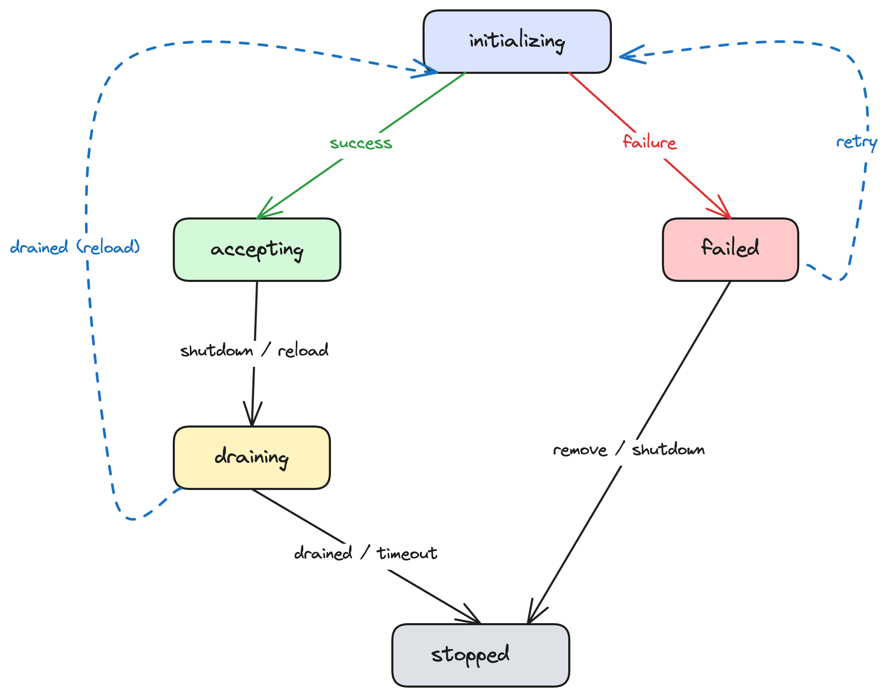

# Proposal 016: Virtual Cluster Lifecycle

## Summary

Introduce a lifecycle state model for virtual clusters so that each cluster has a well-defined operational state at all times. This enables the proxy to handle per-cluster failures gracefully — during startup, shutdown, and future configuration reload — without affecting other clusters.

## Current Situation

Today a virtual cluster is either fully registered (ports bound, accepting connections) or it does not exist. There is no intermediate or error state.

This has several consequences:

1. **Startup is all-or-nothing.** If one virtual cluster fails to start (e.g. port conflict, filter initialisation failure), the entire proxy process fails. Other clusters that could have started successfully are taken down with it.

2. **Shutdown is unstructured.** The proxy stops accepting connections and closes channels, but there is no formal draining phase that ensures in-flight Kafka requests complete before the connection is torn down.

3. **No foundation for partial failure.** Proposals such as [012 - Hot Reload](https://github.com/kroxylicious/design/pull/83) need the ability to express "cluster-b failed to apply new configuration but cluster-a is still serving traffic." Without a lifecycle model this state is undefined and unreportable.

## Motivation

A virtual cluster is the natural unit of independent operation — the smallest scope at which the proxy can contain a failure without affecting unrelated traffic. Today this independence is not modelled: the proxy treats all clusters as a single unit that either starts completely or fails completely.

Making per-cluster independence explicit enables the proxy to isolate configuration errors, startup failures, and runtime problems to the cluster that caused them, rather than treating them as proxy-wide events.

A lifecycle model provides:

- **Resilient startup**: clusters that can start do start; failures are reported rather than fatal.
- **Graceful shutdown**: in-flight requests complete (or time out) before connections close.
- **Observable state**: operators and tooling can query which clusters are operational and which have failed, and why.
- **A foundation for reload**: configuration reload ([012](https://github.com/kroxylicious/design/pull/83)) can define transitions on this state model rather than inventing its own. Lifecycle states are valuable independently of reload — they improve startup resilience and shutdown behaviour — so they are defined separately rather than being embedded in the reload proposal.

## Proposal

### Scope

This proposal covers the lifecycle of individual virtual clusters — their filter chains and upstream connections. It does not cover proxy-level concerns such as port binding, management endpoint availability, or process-level shutdown sequencing. Port binding is managed by the proxy infrastructure and injected into the virtual cluster; the cluster's lifecycle does not own it. A proxy-level lifecycle model is identified as future work.

### Lifecycle States

Each virtual cluster has exactly one state at any time:

| State | Description |
|-------|-------------|
| **initializing** | The cluster is being set up. Not yet accepting connections. Used on first boot, when retrying from `failed`, and during configuration reload. |
| **accepting** | The proxy has completed setup for this cluster and is accepting connections. This state makes no claim about the availability of upstream brokers or other runtime dependencies — it means the proxy is ready to handle connection attempts. |
| **draining** | New connections are rejected. Existing connections remain open to give in-flight requests the opportunity to complete. Connections are closed once idle or when the drain timeout is reached. |
| **failed** | The proxy determined the configuration not to be viable. All partially-acquired resources are released on entry to this state. The proxy retains the cluster's configuration and failure reason for diagnostics and retry. |
| **stopped** | The cluster is no longer operational. All resources have been released. This is a terminal state. |

### State Transitions



**Startup transitions:**
- `initializing` → `accepting`: configuration applied successfully. The proxy is ready to handle connection attempts for this cluster.
- `initializing` → `failed`: configuration could not be applied. Any partially-acquired resources are released before entering `failed`. The error is captured against the cluster state.

**Shutdown transitions:**
- `accepting` → `draining`: the cluster is being shut down or removed. New connections are rejected; existing connections are given the opportunity to complete.
- `draining` → `stopped`: connections are closed (gracefully or via timeout). Terminal.
- `failed` → `stopped`: the cluster is being removed or the proxy is shutting down. Since `failed` clusters have already released their resources, this is a bookkeeping transition. Terminal.

**Reload transitions:**
- `accepting` → `draining`: connections are drained before reconfiguration.
- `draining` → `initializing`: drain is complete, cluster begins applying new configuration.
- `initializing` → `accepting`: new configuration applied successfully.
- `initializing` → `failed`: new configuration could not be applied. Partial resources are cleaned up.

Whether a previous configuration is available for rollback is implementation context that the runtime tracks, not a property of the lifecycle state.

**Recovery transitions:**
- `failed` → `initializing`: a retry is requested (e.g. operator action, reload with corrected config). Since `failed` clusters have already released all resources, this is a clean start from scratch.

### Proxy Startup Behaviour

On startup, the proxy attempts to initialise each virtual cluster in the configuration. Clusters that succeed move to `accepting`. Clusters that fail move to `failed` with a captured reason.

By default, the proxy fails to start if any cluster fails to initialise (fail-fast). This is the correct behaviour for most deployments — configuration errors should be surfaced immediately, especially in development and bare-metal environments.

A configurable startup policy allows deployments where partial availability is preferable to no availability:

```yaml
proxy:
  startupPolicy: fail-fast  # default — any cluster failure prevents startup
  # startupPolicy: best-effort  # start with whatever clusters succeed
```

In best-effort mode, the proxy starts and serves traffic for clusters that initialised successfully, while reporting failed clusters via health endpoints and logs. Kubernetes readiness probes or monitoring systems can apply their own thresholds (e.g. "all clusters must be accepting" vs "at least one cluster must not be failed"). The operator would typically set this policy.

### Graceful Shutdown

When the proxy receives a shutdown signal:

1. All `accepting` clusters transition to `draining`.
2. All `failed` clusters transition directly to `stopped`.
3. New connections are rejected for draining clusters.
4. For each existing connection, the proxy waits for in-flight requests to complete, up to a configurable drain timeout.
5. Once drained (or timed out), connections are closed and clusters move to `stopped`.
6. The proxy process exits.

The drain timeout should be configurable. Kafka consumers with long poll timeouts (`max.poll.interval.ms` defaults to 5 minutes) or slow producers with `acks=all` can legitimately need more than the 30 seconds assumed in current code.

```yaml
proxy:
  drainTimeout: 60s  # default TBD
```

### Observability

Cluster lifecycle state should be observable — through management endpoints, logging, or metrics — so that operators and tooling can determine which clusters are accepting connections, which have failed, and why. The specific reporting mechanism is an implementation concern and not prescribed by this proposal.

### Internal Representation

Each virtual cluster holds a state object:

```java
public record ClusterState(
        LifecyclePhase phase,
        Instant since,
        @Nullable String reason) {

    public enum LifecyclePhase {
        INITIALIZING,
        ACCEPTING,
        DRAINING,
        FAILED,
        STOPPED
    }
}
```

State transitions should be validated — e.g. a cluster cannot move from `stopped` to any other state. Invalid transitions indicate a programming error and should throw.

The component responsible for managing cluster state (likely an evolution of the existing `EndpointRegistry` or a new `ClusterLifecycleManager`) should be the single source of truth for state transitions, ensuring they are logged and observable.

## Affected/not affected projects

**Affected:**
- **kroxylicious-proxy (runtime)**: startup logic, shutdown logic, endpoint registry, health endpoints. This is where the lifecycle state machine lives.
- **kroxylicious-operator**: may choose to inspect per-cluster state for readiness/health reporting. Not required to change immediately.

**Not affected:**
- **kroxylicious-api**: the filter SPI is unaffected. Filters do not need to know about cluster lifecycle.
- **kroxylicious-kms** and other plugin modules: no changes needed.

## Compatibility

The default startup policy is fail-fast, which matches current behaviour — the proxy process exits if any cluster fails to initialise. Existing deployments are unaffected.

The new best-effort startup policy is opt-in. Deployments that enable it should ensure they have appropriate health/readiness checks in place to detect partially-started proxies.

## Rejected Alternatives

### Single boolean health status

We considered a simple healthy/unhealthy model rather than per-cluster states. This is insufficient because:
- It cannot distinguish "one cluster failed to start" from "the entire proxy is broken."
- It provides no information for recovery (which cluster? why?).
- It conflates cluster health with proxy health.

### Automatic retry on failure

We considered having the proxy automatically retry failed clusters on a backoff schedule. This adds complexity (retry policies, backoff configuration, thundering herd concerns) and is better left to external orchestration (Kubernetes controllers, operator logic) that already has retry infrastructure. The lifecycle model exposes the `failed` state; the decision to retry belongs to the operator.

### Retaining resources in `failed` state

We considered having `failed` clusters retain any resources they successfully acquired (e.g. partially-initialised filters, upstream connections) to make retry faster. However, this creates ambiguity about what state a `failed` cluster is actually in and complicates recovery logic.

We decided against this: `failed` clusters release all partially-acquired resources on entry. This means a retry from `failed` is a clean `initializing` cycle. Clean teardown on failure keeps the `failed` state uniform: it always means "no resources held, here's what went wrong."

### Separate `reinitializing` state for reload

We considered a separate `reinitializing` state to distinguish first-time initialisation (no rollback target) from reload (previous configuration available). However, with port binding scoped to the proxy infrastructure rather than the virtual cluster, `initializing` is a clean slate in both cases from the cluster's perspective. Whether a previous configuration is available for rollback is implementation context the runtime tracks, not a lifecycle state concern. A single `initializing` state keeps the model simpler.

### Reload through `stopped`

We considered having the reload path go through `stopped` (`accepting` → `draining` → `stopped` → `initializing` → `accepting`). This would make `stopped` a non-terminal state, changing its meaning from "this cluster is done" to "this cluster might come back." This complicates the model — during shutdown, all clusters reach `stopped`, but some might be re-entering `initializing` for reload while others are genuinely finished. Keeping `stopped` terminal and routing reload through `draining` → `initializing` avoids this ambiguity.

### Runtime health as lifecycle state

We considered splitting the `accepting` state into `healthy` and `degraded` to model runtime health (upstream broker availability, KMS connectivity, etc.) as part of the lifecycle. However, `healthy` and `degraded` had identical inward and outward transitions — both could transition to `draining` for shutdown or reload, and neither gated any lifecycle decision. This is a strong signal that they are not lifecycle states.

Runtime health is also inherently perspectival: different observers (direct clients, load balancers, monitoring systems) may define "healthy" differently, and health signals depend on polling mechanisms with inherent delays. Baking a health model into the lifecycle commits us to a definition we do not yet have and that may not be the same for all consumers.

The lifecycle model's job is to track what the proxy is doing with a cluster — setting it up, accepting connections, draining, or torn down. Whether the cluster can successfully serve traffic is a separate, orthogonal concern better addressed by readiness probes, health endpoints, or metrics that can evolve independently.

### Runtime health model

We considered defining a broader health model alongside the lifecycle — covering upstream broker reachability, KMS availability, filter readiness, and similar runtime concerns. This was ruled out of scope. Health depends on what the proxy is being used for: a proxy doing record encryption has different health criteria from one doing schema validation. The appropriate health model will vary by deployment, and may need to account for request-level routing where health is per-destination rather than per-cluster. Defining a health model prematurely would constrain future design options without providing immediate value. The lifecycle model intentionally leaves room for health to be addressed separately.

## Future Enhancements

### Reload without draining

The current reload path requires draining connections before reinitialising (`accepting` → `draining` → `initializing`). In the future, it may be possible to skip the drain step for certain types of configuration change — for example, swapping the filter chain in place or reconnecting upstream without dropping client connections.

This would introduce a direct `accepting` → `initializing` transition. The state model as proposed accommodates this without structural changes: `initializing` already represents "setting up the cluster," and its exit transitions (`accepting` on success, `failed` on failure) remain the same regardless of whether draining preceded it.

Some configuration changes will likely always require draining — for example, changes to the upstream cluster identity or TLS configuration that invalidate existing connections. The optimisation is about identifying changes where draining can be safely skipped, not eliminating it.

### Proxy-level lifecycle

This proposal covers the lifecycle of individual virtual clusters. The proxy process itself has lifecycle concerns that sit above the per-cluster model: management port binding, process startup/shutdown sequencing, and aggregate health reporting. A proxy-level lifecycle model would define states and transitions for the process as a whole, with per-cluster states feeding into it. Port binding, which is managed by the proxy infrastructure and injected into virtual clusters, would naturally belong to this layer.
