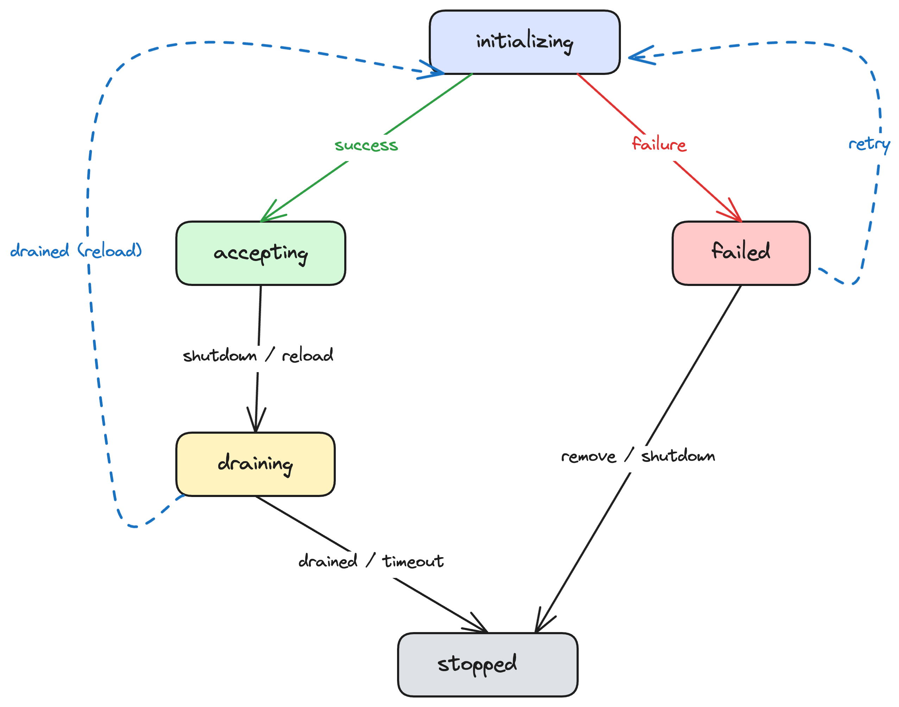

# Proposal 016: Virtual Cluster Lifecycle

## Summary

Introduce a lifecycle state model for virtual clusters so that each cluster has a well-defined operational state at all times. This enables the proxy to handle per-cluster failures gracefully — during startup, shutdown, and future configuration reload — without affecting other clusters.

## Current Situation

Today a virtual cluster is either fully registered (ports bound, serving traffic) or it does not exist. There is no intermediate or error state.

This has several consequences:

1. **Startup is all-or-nothing.** If one virtual cluster fails to start (e.g. port conflict, filter initialisation failure), the entire proxy process fails. Other clusters that could have started successfully never become available.

2. **Shutdown is unstructured.** The proxy stops serving traffic and closes channels, but there is no formal draining phase that ensures in-flight Kafka requests complete before the connection is torn down. While this does not violate any of the guarantees of the Kafka protocol (which needs to cope with network partitions), it would be good to shutdown more gracefully in situations where that's possible.

3. **No foundation for partial failure.** Proposals such as [012 - Hot Reload](https://github.com/kroxylicious/design/pull/83) need the ability to express "cluster-b failed to apply new configuration but cluster-a is still serving traffic." Without a lifecycle model this state is undefined and unreportable.

## Motivation

A virtual cluster is the natural unit of independent operation — the smallest scope at which the proxy can contain a failure without affecting unrelated traffic. Today this independence is notional: the proxy treats all clusters as a single unit that either starts completely or fails completely.

Virtual clusters are entities in the Domain-Driven Design sense: each has a persistent identity that carries through state changes. Each cluster's identifier is its name — it is what distinguishes one cluster from another. Users reason about clusters by name — "cluster-b failed during reload, cluster-a is still serving traffic" — and the lifecycle model matches that intuition. The state machine tracks the lifecycle of the entity, not a specific configuration instance; a reload is a transition the entity passes through, not a replacement of it.

Because the name is the identity, renaming a cluster in the configuration is a destructive operation: the proxy has no way to distinguish a rename from a remove-and-add of a different cluster. Documentation should make this explicit.

Making per-cluster independence explicit enables the proxy to isolate configuration errors, startup failures, and runtime problems to the cluster that caused them, rather than treating them as proxy-wide events.

A lifecycle model provides:

- **Resilient startup**: clusters that can start do start; failures are reported rather than fatal.
- **Graceful shutdown**: in-flight requests complete (or time out) before connections close.
- **Observable state**: operators and tooling can query which clusters are operational and which have failed, and why.
- **A foundation for reload**: configuration reload ([012](https://github.com/kroxylicious/design/pull/83)) can define transitions on this state model rather than inventing its own. Lifecycle states are valuable independently of reload — they improve startup resilience and shutdown behaviour — so they are defined separately rather than being embedded in the reload proposal.

## Proposal

### Scope

This proposal covers the lifecycle of individual virtual clusters — their filter chains and upstream connections. It does not cover proxy-level concerns such as port binding, management endpoint availability, or process-level shutdown sequencing. Port binding is managed by the proxy infrastructure and injected into the virtual cluster; the cluster's lifecycle does not own it. A proxy-level lifecycle model is identified as future work.

### Lifecycle States

Each virtual cluster has exactly one state at any time:

| State | Description |
|-------|-------------|
| **initializing** | The cluster is being set up. Not yet serving traffic. Used on first boot, when retrying from `failed`, and during configuration reload. |
| **serving** | The proxy has completed setup for this cluster and is serving traffic. This state makes no claim about the availability of upstream brokers or other runtime dependencies — it means the proxy is ready to handle connection attempts. |
| **draining** | New connections are rejected. New requests on existing connections are also rejected. Existing in-flight requests are given the opportunity to complete. Connections are closed once all in-flight requests are complete or the drain timeout is reached. |
| **failed** | The proxy determined the configuration not to be viable. All partially-acquired resources are released on entry to this state. The proxy retains the cluster's configuration and failure reason for diagnostics and retry. |
| **stopped** | The cluster has been permanently removed from the configuration. All resources have been released. This is a terminal state — `stopped` is reached when a cluster is explicitly removed or the proxy shuts down, not as part of reload or rollback. |

### State Transitions



**Startup transitions:**
- `initializing` → `serving`: configuration applied successfully. The proxy is ready to handle connection attempts for this cluster.
- `initializing` → `failed`: configuration could not be applied. Any partially-acquired resources are released before entering `failed`. The error is captured against the cluster state.

**Shutdown transitions:**
- `serving` → `draining`: the cluster is being shut down or removed. New connections are rejected; existing in-flight requests are given the opportunity to complete.
- `draining` → `stopped`: connections are closed (gracefully or via timeout). Terminal.
- `failed` → `stopped`: the cluster is being removed or the proxy is shutting down. Since `failed` clusters have already released their resources, this is a bookkeeping transition. Terminal.

**Reload transitions:**
- `serving` → `draining`: connections are drained before reconfiguration.
- `draining` → `initializing`: drain is complete, cluster begins applying new configuration.
- `initializing` → `serving`: new configuration applied successfully.
- `initializing` → `failed`: new configuration could not be applied. Partial resources are cleaned up.

Because the cluster is an entity, these transitions happen on the same entity — it is not replaced on reload. A failed reconfiguration leaves the entity in `failed` state; the recovery transition (`failed` → `initializing`) covers any subsequent retry, whether with a corrected configuration or otherwise.

**Recovery transitions:**
- `failed` → `initializing`: a retry is requested (e.g. operator action, reload with corrected config). Since `failed` clusters have already released all resources, this is a clean start from scratch.

### Proxy Startup Behaviour

On startup, the proxy attempts to initialise each virtual cluster in the configuration. Clusters that succeed move to `serving`. Clusters that fail move to `failed` with a captured reason.

By default, the proxy serves no traffic if any cluster fails to initialise. This is the correct behaviour for most deployments — configuration errors should be surfaced immediately, especially in development and bare-metal environments.

The policy is configurable and applies whenever clusters initialise, whether on first startup or during reload:

```yaml
proxy:
  partialInitialisationPolicy: serve-none  # default — any cluster failure prevents serving traffic
  # partialInitialisationPolicy: serve-others  # serve clusters that initialised successfully
```

In `serve-others` mode, the proxy serves traffic for clusters that initialised successfully, while reporting failed clusters via health endpoints and logs. Kubernetes readiness probes or monitoring systems can apply their own thresholds (e.g. "all clusters must be serving" vs "at least one cluster must not be failed"). The Kubernetes operator would typically set this policy.

### Graceful Shutdown

When the proxy receives a shutdown signal:

1. All `serving` clusters transition to `draining`.
2. All `failed` clusters transition directly to `stopped`.
3. New connections are rejected for draining clusters. New requests on existing connections are also rejected.
4. For each existing connection, the proxy waits for in-flight requests to complete, up to a configurable drain timeout. The proxy takes the same view of in-flight as the Kafka client: a request is in-flight from the moment the client sends it until the client receives a response.
5. Once drained (or timed out), connections are closed and clusters move to `stopped`.
6. The proxy process exits.

The drain timeout should be configurable. Kafka consumers with long poll timeouts (`max.poll.interval.ms` defaults to 5 minutes) or slow producers with `acks=all` can legitimately need more than the 30 seconds assumed in current code.

```yaml
proxy:
  drainTimeout: 60s  # default TBD
```

Graceful draining reduces unnecessary client errors during planned shutdowns, and aligns with how the broader Kafka ecosystem behaves — brokers drain before stopping and operators expect the same from any Kafka component. It is best-effort rather than a guarantee: the drain timeout is the hard backstop. Kafka clients are required to handle connection loss regardless, so forced closure after timeout remains protocol-compliant.

The proxy cannot replicate the Kafka broker's clean shutdown mechanism — brokers coordinate partition leader migration before closing connections, meaning producers follow the new leader without disruption. The proxy has no equivalent mechanism to redirect clients before closing connections. However, idempotent producers retain their Producer ID and sequence numbers in client memory across reconnections — a connection drop does not start a new session. When the client reconnects after a drain, it retries unacknowledged requests with the same (PID, epoch, sequence) tuple, and the broker deduplicates them using its existing producer state. A proxy-initiated drain is therefore no different from any other connection loss event (network partition, broker crash) from the client's perspective, and Kafka clients are already required to handle these. A reload mechanism building on this lifecycle model further improves the situation by confining connection disruption to a single virtual cluster rather than requiring a full process restart.

### Observability

Cluster lifecycle state is public API. Two mechanisms must be provided:

**Management endpoint**: a queryable endpoint returning the current state and failure reason (where applicable) of each virtual cluster, for on-demand inspection by operators and tooling.

**Metrics**: at a minimum, metrics should capture:
- Current state of each virtual cluster (e.g. `kroxylicious_virtual_cluster_state`)
- Time spent in the current state (e.g. `kroxylicious_virtual_cluster_state_duration_seconds`) — enables alerting on clusters stuck in `failed` or `initializing`
- Total state transitions per cluster (e.g. `kroxylicious_virtual_cluster_transitions_total`) — enables detection of instability or flapping

Implementations may expose additional metrics. Metric names and endpoint paths are confirmed in the implementation and documented as public API at that point.


## Affected/not affected projects

**Affected:**
- **kroxylicious-proxy (runtime)**: startup logic, shutdown logic, endpoint registry, health endpoints. This is where the lifecycle state machine lives.
- **kroxylicious-operator**: may choose to inspect per-cluster state for readiness/health reporting. Not required to change immediately.

**Not affected:**
- **kroxylicious-api**: the filter SPI is unaffected. Filters do not need to know about cluster lifecycle.
- **kroxylicious-kms** and other plugin modules: no changes needed.

## Compatibility

The default `partialInitialisationPolicy` is `serve-none`, which matches current behaviour — the proxy process exits if any cluster fails to initialise. Existing deployments are unaffected.

The `serve-others` policy is opt-in. Deployments that enable it should ensure they have appropriate health/readiness checks in place to detect proxies that are only partially serving traffic.

## Rejected Alternatives

### Single boolean health status

We considered a simple healthy/unhealthy model rather than per-cluster states. This is insufficient because:
- It cannot distinguish "one cluster failed to start" from "the entire proxy is broken."
- It provides no information for recovery (which cluster? why?).
- It conflates cluster health with proxy health.

### Automatic retry on failure

We considered having the proxy automatically retry failed clusters on a backoff schedule. This adds complexity (retry policies, backoff configuration, thundering herd concerns) and is better left to external orchestration (Kubernetes controllers, operator logic) that already has retry infrastructure. The lifecycle model exposes the `failed` state; the decision to retry belongs to the operator.

### Retaining resources in `failed` state

We considered having `failed` clusters retain any resources they successfully acquired (e.g. partially-initialised filters, upstream connections) to make retry faster. However, this creates ambiguity about what state a `failed` cluster is actually in and complicates recovery logic.

We decided against this: `failed` clusters release all partially-acquired resources on entry. This means a retry from `failed` is a clean `initializing` cycle. Clean teardown on failure keeps the `failed` state uniform: it always means "no resources held, here's what went wrong."

### Separate `reinitializing` state for reload

We considered a separate `reinitializing` state to distinguish first-time initialisation (no rollback target) from reload (previous configuration available). However, with port binding scoped to the proxy infrastructure rather than the virtual cluster, `initializing` is a clean slate in both cases from the cluster's perspective. Whether a previous configuration is available for rollback is implementation context the runtime tracks, not a lifecycle state concern. A single `initializing` state keeps the model simpler.

### Reload through `stopped`

We considered having the reload path go through `stopped` (`serving` → `draining` → `stopped` → `initializing` → `serving`). This would make `stopped` a non-terminal state, changing its meaning from "this cluster is done" to "this cluster might come back." This complicates the model — during shutdown, all clusters reach `stopped`, but some might be re-entering `initializing` for reload while others are genuinely finished. Keeping `stopped` terminal and routing reload through `draining` → `initializing` avoids this ambiguity.

### Runtime health as lifecycle state

We considered splitting the `serving` state into `healthy` and `degraded` to model runtime health (upstream broker availability, KMS connectivity, etc.) as part of the lifecycle. However, `healthy` and `degraded` had identical inward and outward transitions — both could transition to `draining` for shutdown or reload, and neither gated any lifecycle decision. This is a strong signal that they are not lifecycle states.

Runtime health is also inherently perspectival: different observers (direct clients, load balancers, monitoring systems) may define "healthy" differently, and health signals depend on polling mechanisms with inherent delays. Baking a health model into the lifecycle commits us to a definition we do not yet have and that may not be the same for all consumers.

The lifecycle model's job is to track what the proxy is doing with a cluster — setting it up, serving traffic, draining, or torn down. Whether the cluster can successfully serve traffic is a separate, orthogonal concern better addressed by readiness probes, health endpoints, or metrics that can evolve independently.

Connection-level resilience mechanisms such as circuit-breaking are a manifestation of the same runtime health concerns: the decision to temporarily reject connections is driven by runtime signals such as upstream availability or load. The same reasoning applies — these are not cluster lifecycle transitions in the scope of this proposal, and excluding runtime health from the lifecycle model excludes circuit-breaking with it.

### Runtime health model

We considered defining a broader health model alongside the lifecycle — covering upstream broker reachability, KMS availability, filter readiness, and similar runtime concerns. This was ruled out of scope. Health depends on what the proxy is being used for: a proxy doing record encryption has different health criteria from one doing schema validation. The appropriate health model will vary by deployment, and may need to account for request-level routing where health is per-destination rather than per-cluster. Defining a health model prematurely would constrain future design options without providing immediate value. The lifecycle model intentionally leaves room for health to be addressed separately.

## Future Enhancements

### Reload without draining

The current reload path requires draining connections before reinitialising (`serving` → `draining` → `initializing`). In the future, it may be possible to skip the drain step for certain types of configuration change — for example, swapping the filter chain in place or reconnecting upstream without dropping client connections.

This would introduce a direct `serving` → `initializing` transition. The state model as proposed accommodates this without structural changes: `initializing` already represents "setting up the cluster," and its exit transitions (`serving` on success, `failed` on failure) remain the same regardless of whether draining preceded it.

Some configuration changes will likely always require draining — for example, changes to the upstream cluster identity or TLS configuration that invalidate existing connections. The optimisation is about identifying changes where draining can be safely skipped, not eliminating it.

### Proxy-level lifecycle

This proposal covers the lifecycle of individual virtual clusters. The proxy process itself has lifecycle concerns that sit above the per-cluster model, including port binding, process startup/shutdown sequencing, and aggregate health reporting. There are genuine open questions here without obvious answers:

- Port binding failure is the closest thing to a proxy-level lifecycle event, but it is rare on Kubernetes (ports are pod-scoped) and the failure mode differs on bare metal. Whether a rare-but-catastrophic failure merits a formal lifecycle state is unclear.
- Health aggregation requires deciding how per-cluster states roll up into a process-level readiness signal. "At least one cluster serving" is an obvious threshold, but per-cluster independence has value even when all clusters are failed — they can still be reloaded independently rather than requiring a full process restart. The right aggregation may depend on the deployment model (Kubernetes, bare metal, Ansible) in ways we cannot predict yet.

This proposal provides a foundation by making per-cluster state observable. The aggregation layer can be designed once deployment patterns are better understood. Whether this needs its own proposal or falls out naturally from implementing per-cluster observability remains to be seen.
