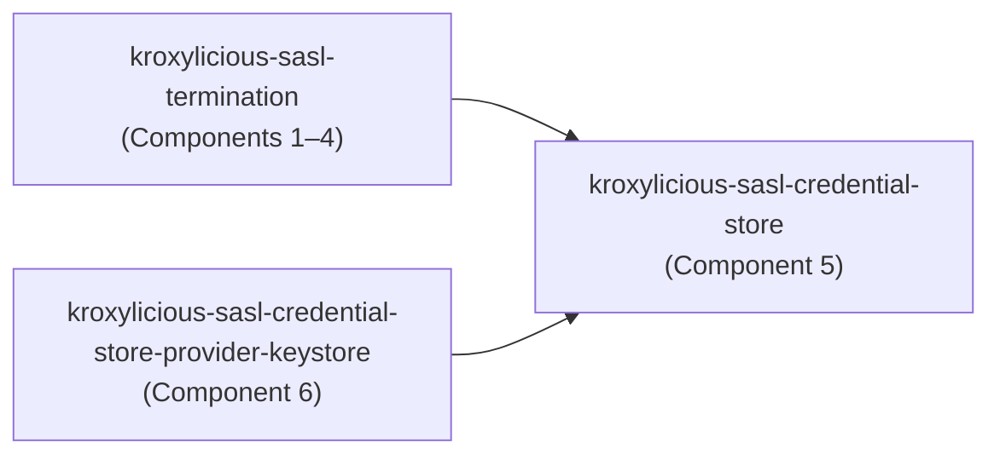
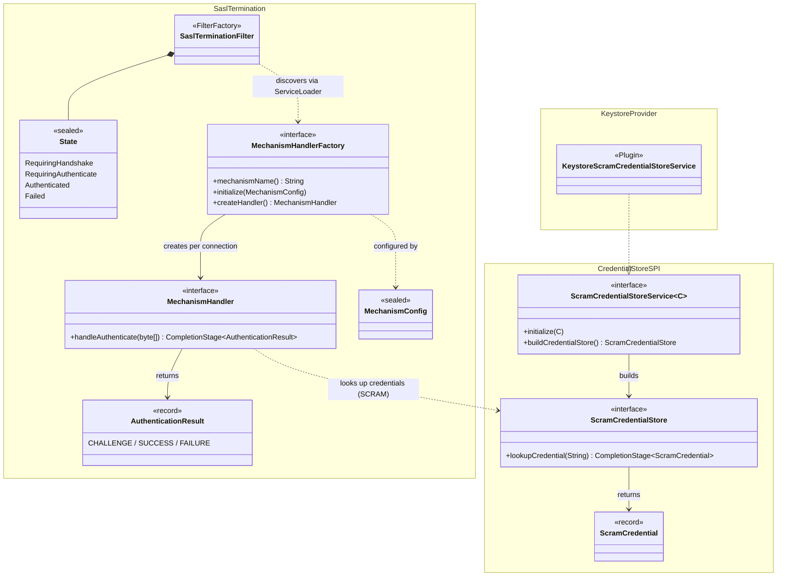
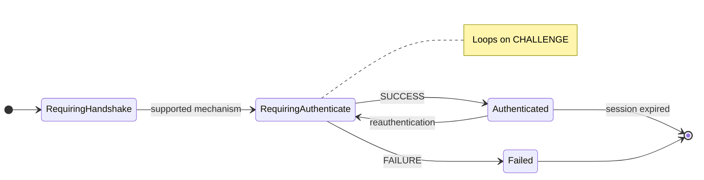

# 124 - SASL Termination

SASL termination allows the Kroxylicious proxy to authenticate Kafka clients directly, without forwarding SASL exchanges to the upstream Kafka broker. This enables credential isolation, authentication protocol translation, and centralized credential management.

## Current situation

Kroxylicious currently handles client SASL authentication in a number of ways:

1. **SASL Passthrough**: The proxy forwards SASL exchanges unmodified between client and broker. The broker performs all authentication. The proxy remains ignorant of the client subject.

2. **SASL Passthrough Inspection**: The [SASL inspection filter][sasl-inspection] observes SASL exchanges as they pass through, extracting the client's authorization ID without making authentication decisions itself. This supports SCRAM-SHA-256, SCRAM-SHA-512, OAUTHBEARER, and PLAIN mechanisms.

3. **OAUTHBEARER Validation**: The [OAUTHBEARER validation filter][oauthbearer-validation] validates JWT tokens before forwarding `SaslAuthenticate` requests to the broker. This is a partial termination — it rejects invalid tokens early but still requires the broker to perform the actual SASL exchange for valid tokens.

None of these approaches allow the proxy to fully terminate SASL: authenticating clients against its own credential store without any SASL interaction with the broker.

[Proposal 004][proposal-004] defined the term "SASL Termination" as: _"a component that responds to a client's `SaslAuthenticate` requests itself, without forwarding those requests to the server."_

[Proposal 006][proposal-006] added the `clientSaslAuthenticationSuccess()` and `clientSaslAuthenticationFailure()` methods to the `FilterContext` API, and explicitly listed "Implement a 1st party SaslTerminator filter" as future work.

This proposal realizes that future work.

## Motivation

### Credential isolation

With SASL termination, the proxy authenticates clients using credentials stored in its own credential store. The broker never sees client credentials. This is valuable when:

- Client credentials should not be shared with or managed by the Kafka cluster administrators.
- Different credential lifecycles are needed for client-facing and broker-facing authentication.
- Compliance requirements mandate credential isolation between organizational boundaries.

**Operational trade-off for SCRAM:** Because the proxy maintains its own credential store, existing Kafka credential management tooling (`KafkaUser` CRs, `kafka-configs.sh`, the Admin API's `AlterUserScramCredentials`) cannot be used to manage proxy credentials. The filter removes `AlterUserScramCredentials` (apiKey 51) from the `API_VERSIONS` response and rejects those requests with a clear error, since the credential store SPI is read-only. `DescribeUserScramCredentials` (apiKey 50) can be answered by the filter from its own credential store — the response contains only the mechanism and iteration count, no sensitive material. Operators with existing SCRAM users on their brokers cannot migrate those credentials to the proxy — they must re-provision users in the proxy's credential store from scratch.

### Authentication protocol translation

The proxy can authenticate clients using one SASL mechanism (e.g. `SCRAM-SHA-256`) while using an entirely different authentication mechanism to connect to the broker (e.g. mTLS, or `OAUTHBEARER`). This enables:

- Migrating broker authentication without changing client configurations.
- Using client-friendly mechanisms even when the broker supports only a limited set.
- Integrating with identity providers that don't have native Kafka client support.

### Zero-trust edge authentication

In a zero-trust architecture the proxy can enforce authentication at the network edge before any Kafka protocol traffic reaches brokers. Unauthenticated clients are rejected immediately, reducing the broker's attack surface.

### Centralized credential management

The credential store is per-filter-instance. Clients of multiple brokers authenticate against a shared credential store, rather than requiring per-broker credential configuration. Combined with the proxy's existing plugin system, this allows integration with enterprise credential stores.

### Broker-less authentication

A key problem with any passthrough-based technique is that it depends on the availability of a specific Kafka cluster. With the advent of the routing API described by [Proposal 072][proposal-072] there is a need to be able to authenticate a client session before a connection has been made to any target cluster. This is unavoidable because the identity of the client might be an input to the subsequent routing decisions.

## Proposal

This proposal aims to support the following SASL mechanisms: `SCRAM-SHA-256`, `SCRAM-SHA-512` and `OAUTHBEARER`.
It also aims to be flexible, so as to allow other mechanisms to be supported in the future.

The proposal is organized per-component. Each component section covers its summary, API surfaces, configuration, threats and mitigations, and known limitations.

### Component overview

The `SaslTerminationFilter` (Component 1) intercepts SASL requests and manages per-connection authentication state via a sealed state machine. It delegates the actual authentication exchange to mechanism-specific `MechanismHandler` instances (Component 2), created per-connection by `MechanismHandlerFactory` implementations discovered via ServiceLoader. The OAUTHBEARER handler factory (Component 4) validates JWT tokens against a JWKS endpoint. The SCRAM handler factories (Component 3) use a `ScramCredentialStore` (Component 5) to look up stored credentials — a public SPI with a first-party KeyStore-backed provider (Component 6).

The implementation spans three modules. Their dependencies:



The key types and their relationships across these modules:



### Component 1: SaslTermination filter

#### Summary

The `SaslTermination` filter is a `@Plugin`-annotated `FilterFactory` that intercepts all requests on a connection. For `SASL_HANDSHAKE` and `SASL_AUTHENTICATE` requests, it authenticates clients at the proxy, short-circuiting those exchanges without forwarding them to the broker. For all other request types, the filter enforces the security barrier: if the client has not completed authentication, the request is rejected and the connection is closed; if the session lifetime has elapsed, the filter does the same, requiring the client to reauthenticate. In practice the unauthenticated rejection should never be reached for non-SASL requests, because failed authentication already closes the connection — but the check exists for defence in depth. Multiple mechanisms are configured within a single filter instance because the Kafka SASL protocol requires it: the client sends a `SaslHandshakeRequest` naming its chosen mechanism, and the server responds with the set of supported mechanisms. A filter-per-mechanism model would not work because no single filter would have the complete set of supported mechanisms to advertise in the `SaslHandshakeResponse`.

Key features:

- **Security barrier.** Until a client has successfully authenticated, the only requests permitted are `API_VERSIONS`, `SASL_HANDSHAKE`, and `SASL_AUTHENTICATE`. All other request types are rejected with `SASL_AUTHENTICATION_FAILED` and the connection is closed.
- **Fail closed on unknown versions.** If a `SASL_HANDSHAKE` or `SASL_AUTHENTICATE` request arrives with an API version outside the range known to the filter, the filter rejects the request and closes the connection. This prevents a future protocol version from bypassing the filter's security logic.
- **State machine.** Per-connection authentication state is modelled as a sealed interface with four concrete states, preventing invalid transitions at compile time.
- **Reauthentication (KIP-368).** When `maxTimeBeforeReauth` is configured, the filter includes a `sessionLifetimeMs` value in `SaslAuthenticateResponse` (v1+), informing the client when to reauthenticate. Sessions that expire without reauthentication are rejected and closed.
- **Mechanism dispatch.** The filter delegates each authentication exchange to a `MechanismHandler` obtained from the appropriate `MechanismHandlerFactory` (see Component 2). The filter itself is mechanism-agnostic.
- **Steady-state optimization.** Once a client is in the `Authenticated` state with no session expiry configured, the filter uses `shouldHandleRequest` to avoid deserializing subsequent requests, letting them pass through without filter overhead.

#### State machine

The filter maintains per-connection state using a sealed interface `State` with four concrete states:

| From state | Triggering event | To state |
|------------|------------------|----------|
| **RequiringHandshake** | `SASL_HANDSHAKE` with supported mechanism | **RequiringAuthenticate** |
| **RequiringAuthenticate** | `SASL_AUTHENTICATE` → handler returns `CHALLENGE` | **RequiringAuthenticate** (loop) |
| **RequiringAuthenticate** | `SASL_AUTHENTICATE` → handler returns `SUCCESS` | **Authenticated** |
| **RequiringAuthenticate** | `SASL_AUTHENTICATE` → handler returns `FAILURE` | **Failed** |
| **Authenticated** | `SASL_HANDSHAKE` (reauthentication) | **RequiringAuthenticate** |
| **Authenticated** | non-SASL request, session not expired | forward to broker |
| **Authenticated** | non-SASL request, session expired | reject and close |
| **Failed** | *(terminal — connection closed)* | — |



**Why there is no `Expired` state:** Session expiry is a property of the `Authenticated` state, checked lazily when the next non-SASL request arrives. An explicit `Expired` state was considered but would be momentary — the connection is immediately either closed (non-SASL request) or transitions to `RequiringAuthenticate` (reauthentication handshake). It would also complicate the handshake guard, which currently accepts handshakes from `RequiringHandshake` and `Authenticated`. The expiry check is a simple conditional within `handleDefaultRequest`, which is easier to audit than an additional state with duplicated transition methods.

**In-flight requests at expiry:** The filter checks expiry before forwarding, so the request that triggers the expiry check never reaches the broker. Previously-forwarded requests whose responses are still in flight will be delivered to the client before the connection closes.

- **RequiringHandshake:** Initial state. Accepts `SASL_HANDSHAKE` requests, which negotiate the mechanism and transition to `RequiringAuthenticate`.
- **RequiringAuthenticate:** Accepts `SASL_AUTHENTICATE` requests. Loops back to itself for multi-round mechanisms (e.g. SCRAM). Carries a reference to the `MechanismHandler` for the negotiated mechanism.
- **Authenticated:** Success state. The filter calls `filterContext.clientSaslAuthenticationSuccess(mechanism, subject)` to propagate the authenticated identity to downstream filters, then forwards all subsequent requests. If reauthentication is configured, this state also stores the session expiry time and allows transition back to `RequiringAuthenticate` via a new `SASL_HANDSHAKE`.
- **Failed:** Terminal failure state. The connection is closed.

#### Reauthentication (KIP-368)

The filter supports [KIP-368][kip368] reauthentication.

**Session lifetime computation:** The effective session lifetime is the minimum of:
1. The configured `maxTimeBeforeReauth` value.
2. The handler-reported credential/token lifetime (e.g. the JWT token's expiry for OAUTHBEARER).

If either value is zero (no opinion / no expiry), the other is used. If both are zero, no reauthentication is required.

Reauthentication is a protocol-level feature, not mechanism-specific — all mechanisms support it. The difference is the session lifetime source:
- **SCRAM:** Credentials do not expire, so the handler reports no lifetime. `maxTimeBeforeReauth` is the sole source of session lifetime. Without it configured, SCRAM sessions never require reauthentication.
- **OAUTHBEARER:** Tokens have an inherent expiry. The handler reports the token's remaining lifetime, and the effective session lifetime is `min(maxTimeBeforeReauth, tokenExpiry)`. Even without `maxTimeBeforeReauth`, sessions expire when the token does.

**Client behaviour:** Standard Kafka clients (4.0+) handle reauthentication transparently via the `Selector`. When the session nears expiry, the client sends a new `SASL_HANDSHAKE` + `SASL_AUTHENTICATE` sequence over the existing connection. This is invisible to application code.

**Server-side enforcement:** If the session has expired and a non-SASL request arrives, the filter rejects it with `SASL_AUTHENTICATION_FAILED` and closes the connection. `API_VERSIONS`, `SASL_HANDSHAKE` and `SASL_AUTHENTICATE` requests are always accepted regardless of session expiry — `API_VERSIONS` is handled unconditionally before the state machine, and the SASL requests allow reauthentication.

#### API surfaces

The filter is a standard Kroxylicious `FilterFactory` plugin. It does not define any new public API. It uses:

- `FilterFactory<SaslTerminationConfig>` (from `kroxylicious-api`) -- the standard filter factory contract.
- `RequestFilter` (from `kroxylicious-api`) -- for intercepting requests.
- `FilterContext.clientSaslAuthenticationSuccess()` / `clientSaslAuthenticationFailure()` (from `kroxylicious-api`, added by Proposal 006) -- to propagate authentication outcomes.
- `MechanismHandlerFactory` (internal, see Component 2) -- for mechanism dispatch.

#### Configuration

The filter is configured via `SaslTerminationConfig`:

| Option | Type | Required | Default | Description |
|--------|------|----------|---------|-------------|
| `mechanisms` | `List<MechanismConfig>` | Yes | -- | List of mechanism configurations. Each entry includes a `mechanism` field (the IANA-registered mechanism name) and mechanism-specific configuration. At least one entry is required. |
| `maxTimeBeforeReauth` | `Duration` | No | disabled | Maximum session lifetime before reauthentication is required (KIP-368). Uses golang-style duration syntax (e.g. `1h`, `30m`, `1h30m`). Omit or set to `0` to disable. |
| `fixedAuthDelay` | `Duration` | No | `200ms` | Fixed delay applied to all authentication rounds to prevent timing side-channel attacks that could enable user enumeration. Set to `0` to disable if the deployment's threat model does not require user enumeration protection. |
| `subjectBuilder` | `SaslSubjectBuilderService` | No | `DEFAULT_SUBJECT_BUILDER` | Plugin for constructing the `Subject` from authentication results. Defaults to `DEFAULT_SUBJECT_BUILDER`, consistent with the existing SASL inspection filter. |

The `mechanisms` list elements are polymorphic. Jackson name-based deserialization (`@JsonTypeInfo(use = JsonTypeInfo.Id.NAME, property = "mechanism")`) resolves the concrete type from the `mechanism` field, which is the IANA-registered mechanism name (e.g. `SCRAM-SHA-256`, `OAUTHBEARER`). This also selects which `MechanismHandlerFactory` handles the exchange.

**Example configuration:**

```yaml
filters:
  - type: SaslTermination
    config:
      maxTimeBeforeReauth: 1h
      fixedAuthDelay: 200ms
      mechanisms:
        - mechanism: SCRAM-SHA-256
          credentialStore: KeystoreScramCredentialStoreService
          credentialStoreConfig:
            file: /path/to/credentials.p12
            storePassword:
              file: /etc/kroxylicious/keystore-password.txt
            storeType: PKCS12
        - mechanism: OAUTHBEARER
          jwksEndpointUrl: https://idp.example.com/.well-known/jwks.json
          expectedAudience: kafka
          expectedIssuer: https://idp.example.com
```

#### Threats and mitigations

| Threat | Mitigation |
|--------|------------|
| Unauthenticated request bypass -- a client sends Kafka protocol requests (Produce, Fetch, etc.) before completing SASL authentication. | The security barrier rejects all non-SASL request types until the state reaches `Authenticated`. Rejected requests receive `SASL_AUTHENTICATION_FAILED` and the connection is closed immediately. |
| Session expiry evasion -- an authenticated client continues sending requests after its session has expired without reauthenticating. | On every non-SASL request in the `Authenticated` state, the filter checks whether the session has expired. If so, the request is rejected with `SASL_AUTHENTICATION_FAILED` and the connection is closed. `SASL_HANDSHAKE` / `SASL_AUTHENTICATE` are always permitted, allowing reauthentication. |

#### Known limitations

- The filter does not support SASL PLAIN or GSSAPI (Kerberos). See [Rejected alternatives](#rejected-alternatives).
- **Delegation tokens are not supported.** The filter removes the delegation token APIs (`CreateDelegationToken`, `RenewDelegationToken`, `ExpireDelegationToken`, `DescribeDelegationToken`) from the `API_VERSIONS` response and rejects those request types with a clear error. Future support may be possible by using `DescribeDelegationToken` to sync token credentials from the broker into the proxy's credential store.

---

### Component 2: MechanismHandler internal extension point

#### Summary

The filter delegates the actual authentication exchange to mechanism-specific handlers, discovered via an internal extension point. This extension point provides internal extensibility for adding new mechanism support without modifying the filter itself.

These are **not** intended to be configurable by end uses (no `@Plugin` annotation). The intention behind this decision is to encourage a small number of secure, high-quality implementations, one for each mechanism. Allowing pluggable implementations would make auditing for correctness and security significantly harder.

#### API surfaces

The extension point consists of three types, all in the `io.kroxylicious.filter.sasl.termination.mechanism` package within the `kroxylicious-sasl-termination` module.

**`MechanismHandler`** -- handles the authentication exchange for a single connection. Instances are per-connection and not thread-safe.

```java
public interface MechanismHandler {

    String mechanismName();

    CompletionStage<AuthenticationResult> handleAuthenticate(byte[] authBytes);

    void dispose();
}
```

**`MechanismHandler` lifecycle:** The filter calls `dispose()` on the handler after SUCCESS (the handler is no longer needed once the client is authenticated) and after FAILURE (the connection is about to close). It is *not* called on raw connection close (e.g. client disconnects mid-exchange) because the `Filter` API has no connection-close hook — the handler becomes unreachable and is garbage collected. Handler implementations must therefore not hold resources that require explicit cleanup beyond what GC provides.

For reauthentication (KIP-368), the previous handler was already disposed at SUCCESS time, so a fresh handler is created for the new exchange.

**`MechanismHandlerFactory`** -- manages mechanism-specific resources and creates handler instances. Discovered via `ServiceLoader`.

```java
public interface MechanismHandlerFactory extends AutoCloseable {

    String mechanismName();

    void initialize(MechanismConfig config, FilterFactoryContext context, Clock clock)
            throws PluginConfigurationException;

    MechanismHandler createHandler();

    @Override
    void close();
}
```

Each factory:
1. Reports its IANA-registered mechanism name via `mechanismName()`.
2. Receives mechanism-specific configuration at `initialize()` time and creates whatever resources the mechanism requires (credential stores, JWKS callback handlers, etc.).
3. Creates per-connection `MechanismHandler` instances via `createHandler()`, injecting shared resources.
4. Releases resources on `close()`.

**`AuthenticationResult`** -- the outcome of processing a single SASL authenticate request.

```java
public record AuthenticationResult(
        Outcome outcome,
        byte[] responseBytes,
        @Nullable String authorizationId,
        @Nullable String errorMessage,
        long sessionLifetimeMs) {

    public enum Outcome { CHALLENGE, SUCCESS, FAILURE }

    public static AuthenticationResult challenge(byte[] responseBytes);
    public static AuthenticationResult success(byte[] responseBytes, String authorizationId);
    public static AuthenticationResult success(byte[] responseBytes, String authorizationId,
            long sessionLifetimeMs);
    public static AuthenticationResult failure(byte[] responseBytes, String errorMessage);
}
```

**`MechanismConfig`** -- sealed interface for mechanism-specific configuration, using Jackson name-based polymorphism on the `mechanism` field:

```java
@JsonTypeInfo(use = JsonTypeInfo.Id.NAME, property = "mechanism")
@JsonSubTypes({
        @JsonSubTypes.Type(value = ScramSha256MechanismConfig.class, name = "SCRAM-SHA-256"),
        @JsonSubTypes.Type(value = ScramSha512MechanismConfig.class, name = "SCRAM-SHA-512"),
        @JsonSubTypes.Type(value = OauthBearerMechanismConfig.class, name = "OAUTHBEARER")
})
public sealed interface MechanismConfig
        permits ScramMechanismConfig, OauthBearerMechanismConfig {
}
```

`ScramMechanismConfig` is an abstract base class whose constructor accepts the mechanism name. The per-variant subclasses contain only a default constructor:

```java
public abstract sealed class ScramMechanismConfig implements MechanismConfig
        permits ScramSha256MechanismConfig, ScramSha512MechanismConfig {

    private final String mechanism;

    protected ScramMechanismConfig(String mechanism) {
        this.mechanism = mechanism;
    }

    // credentialStore, credentialStoreConfig fields...
}

public final class ScramSha256MechanismConfig extends ScramMechanismConfig {
    public ScramSha256MechanismConfig() { super("SCRAM-SHA-256"); }
}

public final class ScramSha512MechanismConfig extends ScramMechanismConfig {
    public ScramSha512MechanismConfig() { super("SCRAM-SHA-512"); }
}
```

#### ServiceLoader discovery

Factories are registered in `META-INF/services/io.kroxylicious.filter.sasl.termination.mechanism.MechanismHandlerFactory`. At filter factory initialization time, the `SaslTermination` filter factory loads all registered factories, matches them to the mechanism names present in the user's configuration, and calls `initialize()` on each matched factory.

#### Built-in mechanism handlers

| Mechanism | Factory | Handler | Specification |
|-----------|---------|---------|---------------|
| `SCRAM-SHA-256` | `ScramSha256HandlerFactory` | `ScramHandler` | [RFC 5802][rfc5802] |
| `SCRAM-SHA-512` | `ScramSha512HandlerFactory` | `ScramHandler` | [RFC 5802][rfc5802] |
| `OAUTHBEARER` | `OauthBearerHandlerFactory` | `OauthBearerHandler` | [RFC 6750][rfc6750] / [RFC 7628][rfc7628] |

#### Known limitations

- Adding a new mechanism requires adding a new `MechanismHandlerFactory` implementation within the `kroxylicious-sasl-termination` module, a new `MechanismConfig` subtype, and updating the sealed permit list. This is intentional.

---

### Component 3: SCRAM mechanism handler

#### Summary

The SCRAM mechanism handler (`ScramHandler`) implements multi-round `SCRAM-SHA-256` and `SCRAM-SHA-512` authentication by delegating to Apache Kafka's own `SaslServer` implementation via the JSSE/SASL framework. Two factories -- `ScramSha256HandlerFactory` and `ScramSha512HandlerFactory` -- manage the credential store lifecycle and create per-connection handler instances.

Key features:

- **Multi-round SCRAM exchange.** SCRAM is a challenge-response protocol. The handler processes the client-first-message (round 1) and subsequent rounds, returning `CHALLENGE` until the exchange completes.
- **Delegation to Kafka's `SaslServer`.** The handler does not reimplement SCRAM. It creates a Kafka `SaslServer` with a `CallbackHandler` that supplies the looked-up credential, then processes all messages through it. This benefits from Kafka's battle-tested implementation.
- **Timing side-channel mitigation.** A configurable fixed delay (`fixedAuthDelay`) is applied to all authentication rounds to prevent attackers from distinguishing existing from non-existing users by measuring response times. Set to `0` to disable if the deployment's threat model does not require user enumeration protection.

#### Authentication flow

1. **First round:** Extract the username from the SCRAM client-first-message, asynchronously look up the credential from the `ScramCredentialStore`, create a `SaslServer` with a `CallbackHandler` that supplies the credential, and process the first message.
2. **Subsequent rounds:** Process messages through the existing `SaslServer` synchronously. When `SaslServer.isComplete()` returns true, return `SUCCESS` with the authorization ID from `SaslServer.getAuthorizationID()`.

#### API surfaces

The SCRAM handler factories use:

- `MechanismHandlerFactory` / `MechanismHandler` (internal, Component 2) -- the internal extension point.
- `ScramCredentialStore` (public SPI, Component 5) -- for credential lookup. The factory resolves the credential store plugin at `initialize()` time using the Kroxylicious plugin system (`@PluginImplName` / `@PluginImplConfig`).

#### Configuration

SCRAM mechanisms are configured via `ScramMechanismConfig` (see Component 2 for the `ScramSha256MechanismConfig` / `ScramSha512MechanismConfig` subclasses). The base class carries the credential store configuration:

```java
public abstract sealed class ScramMechanismConfig implements MechanismConfig
        permits ScramSha256MechanismConfig, ScramSha512MechanismConfig {

    @JsonProperty(required = true)
    @PluginImplName(ScramCredentialStoreService.class)
    private String credentialStore;

    @JsonProperty(required = true)
    @PluginImplConfig(implNameProperty = "credentialStore")
    private Object credentialStoreConfig;
}
```

| Option | Type | Required | Default | Description |
|--------|------|----------|---------|-------------|
| `credentialStore` | `String` | Yes | -- | Plugin name of the `ScramCredentialStoreService` implementation (e.g. `KeystoreScramCredentialStoreService`). Resolved via the Kroxylicious plugin system. |
| `credentialStoreConfig` | `Object` | Yes | -- | Type-safe configuration for the credential store plugin. The actual type depends on the `credentialStore` plugin and is resolved via `@PluginImplConfig`. |

#### Threats and mitigations

| Threat | Mitigation |
|--------|------------|
| Username enumeration -- an attacker distinguishes existing from non-existing users by observing different error messages. | When a user is not found, the handler returns a generic `"Authentication failed"` error message identical to the message returned for incorrect credentials. |
| Timing side-channel -- an attacker distinguishes existing from non-existing users by measuring response times (credential lookup, deserialization, and SCRAM server creation take different amounts of time depending on whether the user exists). | Rather than trying to equalize inherently different code paths (which is fragile under JIT optimizations and varies by credential store implementation), the filter applies a configurable fixed delay (`fixedAuthDelay`) to all authentication rounds. The delay is long enough to swamp any timing differences but short enough to be negligible for Kafka's typically long-lived connections. If the observed authentication duration exceeds the configured delay, a WARN log is emitted indicating the delay should be increased. The delay can be disabled by setting `fixedAuthDelay` to `0` if the deployment's threat model does not require user enumeration protection. |
| SCRAM protocol correctness -- a bug in the SCRAM implementation could allow authentication bypass or credential leakage. | Delegated to Kafka's own `SaslServer`, which is widely deployed and well-tested. The handler is responsible only for credential lookup and passing credentials to the `SaslServer` via a `CallbackHandler`. |

#### Known limitations

- **SCRAM channel binding not supported.** [RFC 5802 Section 6][rfc5802-s6] describes channel binding for SCRAM. Kafka does not use SCRAM channel binding, so this implementation follows Kafka's approach and does not implement it.

---

### Component 4: OAUTHBEARER mechanism handler

#### Summary

The OAUTHBEARER mechanism handler (`OauthBearerHandler`) validates JWT bearer tokens at the proxy without forwarding them to the broker. The `OauthBearerHandlerFactory` manages the JWKS endpoint configuration and callback handler lifecycle.

Key features:

- **JWT validation via Kafka's `OAuthBearerValidatorCallbackHandler`.** The factory configures the callback handler at `initialize()` time with the JWKS endpoint, expected audience/issuer, and refresh settings. Per-connection handlers receive the shared callback handler and use it to create a `SaslServer` via the JSSE/SASL framework.
- **Token lifetime extraction for reauthentication.** After successful authentication, the handler extracts the token's remaining lifetime from the `SaslServer`'s negotiated `CREDENTIAL.LIFETIME.MS` property, returning it via `AuthenticationResult.sessionLifetimeMs` for use in session lifetime computation (see [Reauthentication](#reauthentication-kip-368)).
- **No credential store required.** OAUTHBEARER is architecturally simpler than SCRAM -- the factory's only external dependency is the JWKS endpoint, and authentication is typically single-round (client sends token, server validates it).

**Key differences from the existing OAUTHBEARER validation filter:**
- The existing validation filter validates tokens then _forwards_ the SASL exchange to the broker. It is fundamentally a SASL passthrough technique. In contrast, the termination handler validates tokens and _short-circuits_ -- the broker never sees a SASL exchange.
- The handler factory owns its callback handler and JWKS configuration, receiving them at `initialize()` time rather than requiring a credential store.

#### API surfaces

The OAUTHBEARER handler factory uses:

- `MechanismHandlerFactory` / `MechanismHandler` (internal, Component 2) -- the internal extension point.

It does not use the `ScramCredentialStore` SPI. Token validation is performed entirely by Kafka's `OAuthBearerValidatorCallbackHandler`.

#### Configuration

OAUTHBEARER is configured via `OauthBearerMechanismConfig`:

| Option | Type | Required | Default | Description |
|--------|------|----------|---------|-------------|
| `jwksEndpointUrl` | `URI` | Yes | -- | URL of the JWKS endpoint for fetching token signing keys. |
| `expectedAudience` | `String` | Yes | -- | Expected `aud` claim value. Comma-separated for multiple audiences. Tokens without a matching audience are rejected. |
| `expectedIssuer` | `String` | Yes | -- | Expected `iss` claim value. Tokens from a different issuer are rejected. |
| `scopeClaimName` | `String` | No | `"scope"` | JWT claim name containing the scope. |
| `subClaimName` | `String` | No | `"sub"` | JWT claim name containing the subject. |
| `jwksEndpointRefreshMs` | `Long` | No | Kafka default | Interval in milliseconds between JWKS endpoint refreshes. |
| `jwksEndpointRetryBackoffMs` | `Long` | No | Kafka default | Initial retry backoff in milliseconds when the JWKS endpoint is unreachable. |
| `jwksEndpointRetryBackoffMaxMs` | `Long` | No | Kafka default | Maximum retry backoff in milliseconds. |

**Security note:** `expectedAudience` and `expectedIssuer` are both required. Without audience validation, a token issued for a different service would be accepted; without issuer validation, tokens from any issuer whose keys happen to be in the JWKS would be accepted.

#### Threats and mitigations

| Threat | Mitigation |
|--------|------------|
| Token from wrong audience or issuer -- a JWT issued for a different service or identity provider is presented to the proxy. | Both `expectedAudience` and `expectedIssuer` are required fields. The handler rejects tokens that do not match. |
| JWKS endpoint compromise -- an attacker controls the JWKS endpoint and supplies signing keys for forged tokens. | Mitigated operationally: the JWKS endpoint URL is set by the proxy administrator, not by clients. TLS protects the endpoint in transit (using the JVM's default trust store). |

#### Known limitations

- **No TLS configuration for the JWKS endpoint.** Kafka's `OAuthBearerValidatorCallbackHandler` uses an internal HTTP client with no TLS configuration surface. There is no way to configure custom trust stores or client certificates for HTTPS communication with the JWKS endpoint. The JVM's default trust store is used. This limitation is inherited from Kafka's callback handler and shared with the existing OAUTHBEARER validation filter.
- **No rate limiting.** The handler does not implement rate limiting or brute-force protection for failed authentication attempts. The existing OAUTHBEARER validation filter has Caffeine-based rate limiting with exponential backoff that could serve as a reference for a future implementation.
- **Hardcoded `BrokerJwtValidator`.** The handler hardcodes `BrokerJwtValidator` as the JWT validator. The existing OAUTHBEARER validation filter allows this to be overridden via `jwtValidatorClass` for custom claim validation logic.

---

### Component 5: ScramCredentialStore SPI (public plugin API)

#### Summary

The `ScramCredentialStore` SPI, defined in the `kroxylicious-sasl-credential-store` module, is the user-facing plugin API for SCRAM credential store providers. It provides asynchronous credential lookup decoupled from any particular storage backend.

The SPI is intentionally SCRAM-specific. OAUTHBEARER uses token validation against a JWKS endpoint, which has a fundamentally different shape from stored credential lookup. Rather than creating a leaky abstraction that covers both, each mechanism family uses its own resource management approach (see [Rejected alternatives](#rejected-alternatives)).

**No Kafka type dependencies.** The SPI types (`ScramCredentialStore`, `ScramCredentialStoreService`, `ScramCredential`, exception hierarchy) do not reference any Kafka types. Implementors of the credential store SPI are not transitively exposed to Kafka internal APIs.

#### API surfaces

All types are in the `io.kroxylicious.sasl.credentialstore` package.

**`ScramCredentialStore`** -- the lookup interface:

```java
public interface ScramCredentialStore {

    CompletionStage<ScramCredential> lookupCredential(String username);
}
```

Returns a `CompletionStage` that completes with:
- A `ScramCredential` if the user exists.
- `null` if the user does not exist.
- Exceptional completion with `CredentialLookupException` (or subtype) on infrastructure failure.

**`ScramCredentialStoreService<C>`** -- the lifecycle interface for credential store providers. Follows the same initialize/build/close pattern used by `KmsService<C>`:

```java
public interface ScramCredentialStoreService<C> extends AutoCloseable {

    void initialize(C config);

    ScramCredentialStore buildCredentialStore() throws IllegalStateException;

    @Override
    default void close() { }
}
```

Lifecycle:
1. `initialize(C config)` -- validate and store configuration. Called exactly once.
2. `buildCredentialStore()` -- create an operational store instance. May be called multiple times.
3. `close()` -- release resources. Must be idempotent. Must tolerate being called on an uninitialized or partially initialized service.

**`ScramCredential`** -- immutable record holding the SCRAM credential data:

```java
public record ScramCredential(
        String username,
        byte[] salt,
        int iterations,
        byte[] serverKey,
        byte[] storedKey,
        String hashAlgorithm) {

    public static final int MINIMUM_ITERATIONS = 4096;
    // Supported: "SHA-256", "SHA-512"
}
```

Security properties:
- `byte[]` fields (`salt`, `serverKey`, `storedKey`) use defensive copies in both the constructor and accessors.
- `toString()` redacts sensitive fields (salt, serverKey, storedKey).
- `iterations` must be at least 4096 (RFC 5802 minimum).
- `hashAlgorithm` must be `"SHA-256"` or `"SHA-512"`.

**Exception hierarchy:**

```java
public class CredentialLookupException extends Exception { ... }

public class CredentialServiceUnavailableException extends CredentialLookupException { ... }

public class CredentialServiceTimeoutException extends CredentialLookupException { ... }
```

- `CredentialLookupException` -- base exception for credential lookup failures (service-level issues, not user-not-found).
- `CredentialServiceUnavailableException` -- backing service is unavailable (database down, LDAP unreachable, etc.).
- `CredentialServiceTimeoutException` -- lookup operation timed out.

#### Known limitations

- The SPI covers only SCRAM credential lookup. There is no generic credential store abstraction spanning mechanisms. This is a deliberate design decision (see [Rejected alternatives](#rejected-alternatives)).

---

### Component 6: KeyStore credential store provider

#### Summary

The first-party credential store provider, in the `kroxylicious-sasl-credential-store-provider-keystore` module, stores SCRAM credentials in a Java `KeyStore` file. It follows the project's established pattern of using KeyStores to store secrets. Each credential is serialized as JSON and stored as a `SecretKey` entry keyed by username.

Key features:

- **PKCS12 and JKS support.** Both KeyStore types are supported.
- **In-memory loading.** The entire KeyStore is loaded into memory at construction time for sub-millisecond lookups.
- **`PasswordProvider` for secrets.** Uses the Kroxylicious `PasswordProvider` abstraction for KeyStore and key passwords, supporting both file-based (production) and inline (development) password configuration.
- **File permission enforcement.** On POSIX systems, the credential store refuses to load a KeyStore file that has group or world read/write permissions. This prevents accidental exposure through overly permissive file modes.

#### API surfaces

- Implements `ScramCredentialStoreService<KeystoreScramCredentialStoreConfig>` (from Component 5).
- Annotated with `@Plugin` for discovery by the Kroxylicious plugin system.

#### Configuration

The provider is configured via `KeystoreScramCredentialStoreConfig`:

| Option | Type | Required | Default | Description |
|--------|------|----------|---------|-------------|
| `file` | `String` | Yes | -- | Path to the Java KeyStore file. |
| `storePassword` | `PasswordProvider` | Yes | -- | Password provider for the KeyStore. In production, use file-based password (`file: /path/to/password.txt`). |
| `keyPassword` | `PasswordProvider` | No | value of `storePassword` | Password provider for individual keys within the KeyStore. Defaults to `storePassword` if not specified. |
| `storeType` | `String` | No | `KeyStore.getDefaultType()` | KeyStore type (e.g. `PKCS12`, `JKS`). Defaults to the JVM platform default. |

#### CLI tool: `KeystoreCredentialTool`

The credentials stored in the KeyStore are serialized JSON, which makes for less than ideal UX: the user needs to ensure the JSON has the required format. Moreover, some fields are computed from cryptographic operations on the password which must be done correctly for authentication to work, and where incorrect construction can undermine security.

To provide a better UX and to reduce the possibility of user error compromising security, a PicoCLI-based command-line tool is provided for managing credentials in KeyStore files.

**Global options:**

```
keystore-credential-tool [--unlock-insecure-options] <command> [options]
```

| Option | Description |
|--------|-------------|
| `--unlock-insecure-options` | Enable command-line password options (`-p`, `-w`). Without this flag, passwords must be entered via interactive console prompts. Displays security warnings when used. |

**Commands:**

```
keystore-credential-tool create -k <path> [-p <password>] [-t <type>]
```

Create a new, empty KeyStore file.

| Option | Required | Default | Description |
|--------|----------|---------|-------------|
| `-k`, `--keystore` | Yes | — | Path to the KeyStore file to create. |
| `-p`, `--password` | No | interactive prompt | KeyStore password. Requires `--unlock-insecure-options`. |
| `-t`, `--type` | No | `PKCS12` | KeyStore type (`PKCS12`, `JKS`). |

```
keystore-credential-tool add-user -k <path> -u <username> [-p <password>] [-w <password>] [-m <mechanism>]
```

Add a SCRAM credential for a user. If the user already exists, their credential is replaced.

| Option | Required | Default | Description |
|--------|----------|---------|-------------|
| `-k`, `--keystore` | Yes | — | Path to the KeyStore file. |
| `-u`, `--username` | Yes | — | Username to add. |
| `-p`, `--password` | No | interactive prompt | KeyStore password. Requires `--unlock-insecure-options`. |
| `-w`, `--user-password` | No | interactive prompt | User's password. Requires `--unlock-insecure-options`. |
| `-m`, `--mechanism` | No | `SCRAM_SHA_256` | SCRAM mechanism (`SCRAM_SHA_256`, `SCRAM_SHA_512`). |

```
keystore-credential-tool remove-user -k <path> -u <username> [-p <password>]
```

Remove a user's credential from the KeyStore.

| Option | Required | Default | Description |
|--------|----------|---------|-------------|
| `-k`, `--keystore` | Yes | — | Path to the KeyStore file. |
| `-u`, `--username` | Yes | — | Username to remove. |
| `-p`, `--password` | No | interactive prompt | KeyStore password. Requires `--unlock-insecure-options`. |

```
keystore-credential-tool update-password -k <path> -u <username> [-p <password>] [-w <password>] [-m <mechanism>]
```

Update a user's password. Recomputes the SCRAM credential with a new salt.

| Option | Required | Default | Description |
|--------|----------|---------|-------------|
| `-k`, `--keystore` | Yes | — | Path to the KeyStore file. |
| `-u`, `--username` | Yes | — | Username to update. |
| `-p`, `--password` | No | interactive prompt | KeyStore password. Requires `--unlock-insecure-options`. |
| `-w`, `--new-password` | No | interactive prompt | New password for the user. Requires `--unlock-insecure-options`. |
| `-m`, `--mechanism` | No | `SCRAM_SHA_256` | SCRAM mechanism (`SCRAM_SHA_256`, `SCRAM_SHA_512`). |

```
keystore-credential-tool list-users -k <path> [-p <password>]
```

List all usernames in the KeyStore.

| Option | Required | Default | Description |
|--------|----------|---------|-------------|
| `-k`, `--keystore` | Yes | — | Path to the KeyStore file. |
| `-p`, `--password` | No | interactive prompt | KeyStore password. Requires `--unlock-insecure-options`. |

**Exit codes:** `0` = success, `1` = operation error, `2` = password/security error.

**Security measures:**
- Passwords are read via interactive console prompts by default because passing secrets via CLI arguments is insecure (they appear in shell history and process listings). Command-line password arguments are supported but gated behind an `--unlock-insecure-options` flag that displays security warnings.
- A 12-character minimum password length is enforced, following [NIST SP 800-63B][nist-sp800-63b] guidance.
- SCRAM credentials are generated with 10,000 PBKDF2 iterations and 20 bytes of random salt. The [RFC 5802][rfc5802] minimum is 4,096 (which is also the Kafka broker default). The [OWASP Password Storage Cheat Sheet][owasp-password-storage] currently recommends 600,000 iterations for PBKDF2-HMAC-SHA256, but that guidance targets password storage hashing where derivation happens once at write time. In SCRAM, the client performs the derivation on every authentication, so the iteration count directly affects authentication latency. 10,000 provides a reasonable balance between brute-force resistance and authentication performance for Kafka's typically long-lived connections.
- On POSIX systems, newly created KeyStore files are set to owner-only permissions (`rw-------`). When loading an existing KeyStore for modification (`add-user`, `remove-user`, `update-password`, `list-users`), the tool checks that the file does not have group or world read/write permissions and refuses to proceed if it does.

#### Threats and mitigations

| Threat | Mitigation |
|--------|------------|
| KeyStore file exposure -- an attacker gains read access to the KeyStore file on disk. | POSIX file permission check: the provider checks file permissions before loading, requiring `0600` or stricter by default. On Kubernetes/OpenShift where group-readable files are necessary, the `KROXYLICIOUS_DANGEROUSLY_CHANGE_PERMISSION_CHECK` environment variable allows relaxing to `0640`. The KeyStore itself is password-encrypted. |

**Accepted risk: credential material in JVM heap.** SCRAM credential data (serverKey, storedKey, salt) is held in memory for the lifetime of the proxy. An attacker who can obtain a heap dump (e.g. via JMX, `/proc/<pid>/mem`, or a core dump) can extract this material. There is no practical mitigation within a JVM. Operators should protect heap dump access through operational controls (JMX authentication, file permissions on core dumps, container security policies).

Note: `ScramCredential` uses defensive copies for `byte[]` fields and redacts `toString()`, but these are correctness measures (preventing accidental mutation and log leakage), not security mitigations against heap inspection.

#### Known limitations

- **No hot reloading.** Credential changes require a proxy restart or virtual cluster reconfiguration. The KeyStore is loaded once at construction time.

---

### Component 7: Module architecture

The implementation is organized into three modules, following the same pattern as the existing KMS modules (`kroxylicious-kms`, `kroxylicious-kms-provider-*`):

| Module | Contents | Components |
|--------|----------|------------|
| `kroxylicious-filters/kroxylicious-sasl-termination` | Filter, state machine, `MechanismHandler` / `MechanismHandlerFactory` internal SPI, `MechanismConfig` sealed hierarchy, and all built-in mechanism handler implementations (SCRAM, OAUTHBEARER). | 1, 2, 3, 4 |
| `kroxylicious-sasl-credential-store` | Public API: `ScramCredentialStore`, `ScramCredentialStoreService`, `ScramCredential`, exception hierarchy. No implementation, no Kafka dependencies. | 5 |
| `kroxylicious-sasl-credential-store-providers/kroxylicious-sasl-credential-store-provider-keystore` | First-party SCRAM credential provider: Java KeyStore-backed `ScramCredentialStoreService` implementation with `KeystoreCredentialTool` CLI. | 6 |

## Security model

### Credential storage

- **KeyStore encryption:** Credentials are stored in Java KeyStore files, encrypted with the KeyStore password. File-system permissions and KeyStore passwords are the primary access controls.
- **PasswordProvider abstraction:** Production deployments should use file-based passwords rather than inline passwords in configuration. The `PasswordProvider` interface supports both.
- **File permission enforcement:** On POSIX systems, the credential store checks the KeyStore file's permissions before loading it. By default, group or world read/write permissions are rejected (`0600` or stricter required). This prevents accidental exposure of credential material through overly permissive file modes. The required permission level is configurable via the `KROXYLICIOUS_DANGEROUSLY_CHANGE_PERMISSION_CHECK` environment variable, which can be set to `0640` to allow group-readable files. This is necessary on OpenShift, where the `restricted-v2` SCC runs containers as an arbitrary UID while Secret volume files are owned by root — requiring group-readable permissions (`defaultMode: 0440` with `fsGroup`) for the container process to access them. The environment variable is set in the PodSpec by the `kroxylicious-operator`, keeping the trust chain secure: operator → pod spec → env var → policy, with no writable config file in the loop. Using a config file for this setting would create a bootstrapping problem — if the config file itself were group-writable, an attacker could downgrade the permission policy.
- **In-memory handling:** `ScramCredential` uses defensive copies for `byte[]` fields (correctness measure against accidental mutation) and `toString()` redacts sensitive fields (prevents log leakage). Credential material in the JVM heap is an accepted risk — see Component 6 threat discussion.

### SCRAM protocol correctness

The implementation delegates to Kafka's own `SaslServer` for SCRAM, which is widely deployed and well-tested. The handler is responsible only for credential lookup and passing credentials to the `SaslServer` via a `CallbackHandler`.

### Username enumeration prevention

When a user is not found in the credential store, the handler returns a generic `"Authentication failed"` error message, identical to the message returned for incorrect credentials. The error does not reveal whether the username exists.

### Timing side-channel mitigation

Without mitigation, an attacker could distinguish existing from non-existing users by measuring response times: credential lookup, deserialization, and SCRAM server creation take different amounts of time depending on whether the user exists. Rather than trying to equalize these inherently different code paths (which is fragile under JIT optimizations and varies by credential store implementation), the filter applies a configurable fixed delay (`fixedAuthDelay`) to all authentication rounds. The delay is long enough to swamp any timing differences but short enough to be negligible for Kafka's typically long-lived connections. If the observed authentication duration exceeds the configured delay, a WARN log is emitted indicating the delay should be increased. The delay can be disabled by setting `fixedAuthDelay` to `0` if the deployment's threat model does not require user enumeration protection.

### Observability

#### Runtime-level metrics

The proxy runtime emits authentication outcome metrics when any filter announces an authentication result via `FilterContext.clientSaslAuthenticationSuccess()` or `clientSaslAuthenticationFailure()`. These apply uniformly to all authentication approaches (SASL termination, SASL inspection, transport authentication).

| Metric | Type | Tags | Description |
|--------|------|------|-------------|
| `kroxylicious_client_auth_total` | Counter | `virtual_cluster`, `mechanism`, `outcome` (`success` / `failure`) | Authentication outcomes. |

#### Filter-specific metrics

The SASL termination filter emits additional metrics for authentication latency and session expiry.

| Metric | Type | Tags | Description |
|--------|------|------|-------------|
| `kroxylicious_filter_sasl_termination_auth_duration_seconds` | Timer | `virtual_cluster`, `mechanism` | Authentication latency, exclusive of the configured fixed timing delay. Measures the real work: credential store lookup, token validation, SCRAM rounds. |
| `kroxylicious_filter_sasl_termination_session_expired_total` | Counter | `virtual_cluster`, `mechanism` | Sessions that expired without the client reauthenticating. |

### Connection lifecycle safety

- The sealed state machine prevents invalid state transitions at compile time.
- The security barrier is enforced for all non-SASL request types. Unauthenticated requests are rejected and the connection is closed.
- On authentication failure, the connection is closed immediately.

### CLI tool security

- Interactive password prompts prevent exposure of passwords in shell history and process listings.
- The `--unlock-insecure-options` flag gates command-line password arguments with explicit security warnings.
- 12-character minimum password length follows NIST SP 800-63B recommendations.

### Threats considered but out of scope

- **SCRAM channel binding:** [RFC 5802 Section 6][rfc5802-s6] describes channel binding for SCRAM. Kafka does not use SCRAM channel binding, so this implementation follows Kafka's approach.

## Affected/not affected projects

**New modules:**
- `kroxylicious-sasl-credential-store` — public API module
- `kroxylicious-sasl-credential-store-providers/kroxylicious-sasl-credential-store-provider-keystore` — KeyStore provider
- `kroxylicious-filters/kroxylicious-sasl-termination` — termination filter

**Modified modules:**
- `kroxylicious-bom` — new dependency declarations
- Root `pom.xml` — new module entries
- `kroxylicious-integration-tests` — SASL termination integration tests
- `kroxylicious-docs` — authentication guide (expanded from SASL inspection guide)

**Not affected:**
- `kroxylicious-api` — no API changes needed (uses existing `clientSaslAuthenticationSuccess`/`clientSaslAuthenticationFailure` from proposal 006)
- `kroxylicious-runtime` — authentication outcome metrics (`kroxylicious_client_auth_total`)
- `kroxylicious-kms` and KMS providers — unrelated
- `kroxylicious-kubernetes` — the operator should set `KROXYLICIOUS_DANGEROUSLY_CHANGE_PERMISSION_CHECK=0640` in the PodSpec on OpenShift (and optionally on plain Kubernetes) to allow group-readable Secret volume mounts

## Compatibility

This is a new feature with no breaking changes:
- Existing proxy configurations continue to work unchanged.
- The SASL inspection filter is unaffected and can still be used for passthrough inspection.
- The OAUTHBEARER validation filter is unaffected.
- The credential store API (`kroxylicious-sasl-credential-store`) is a new public API. Once released, it will follow the project's API stability rules.

## Kafka internal API dependencies

This implementation uses several Kafka APIs that are not part of the [published Kafka javadoc][kafka-javadoc] and may change without notice in future Kafka releases. [Proposal 116][proposal-116] (Kafka API migration) would bring all of these under a Kroxylicious-owned namespace, insulating this code from upstream Kafka reorganisations.

**`org.apache.kafka.common.message.*` and `org.apache.kafka.common.protocol.*`** (`ApiKeys`, `Errors`, `RequestHeaderData`, `SaslAuthenticateRequestData`, etc.) — The Kafka protocol message classes. Not in Kafka's public javadoc, but a foundational dependency for Kroxylicious: the filter API itself (`RequestFilter`) exposes these types. All Kroxylicious filters depend on them. These are the primary target of [Proposal 116][proposal-116] and would become fully Kroxylicious-owned.

**`org.apache.kafka.common.security.oauthbearer.internals.OAuthBearerSaslServerProvider`** — Called once (`initialize()`) to register the OAUTHBEARER SASL mechanism with the JVM's security provider infrastructure. The existing OAUTHBEARER validation filter uses this in the same way. There is no public API alternative. [Proposal 116][proposal-116] would copy this into the Kroxylicious namespace, giving stability control, but the functional dependency on Kafka's JSSE provider registration code remains.

**`org.apache.kafka.common.security.scram.internals.ScramMechanism`** — An enum identifying SCRAM-SHA-256 and SCRAM-SHA-512. Used internally by the SCRAM handler factories and the keystore credential manager. There is no public API equivalent. [Proposal 116][proposal-116] would own this type, but it is a trivial enum that could equally be replaced with a Kroxylicious-native type.

**`org.apache.kafka.common.security.scram.internals.ScramFormatter`** — Used by `KeystoreCredentialManager` to derive salted passwords, server keys, and stored keys from plaintext passwords. This is the only implementation of SCRAM key derivation available in the Kafka client library. There is no public API equivalent. [Proposal 116][proposal-116] would copy this into the Kroxylicious namespace, but unlike the protocol data classes, `ScramFormatter` is a functional security implementation (PBKDF2, HMAC) — the maintenance burden of keeping it current remains.

All of these dependencies are contained within the implementation modules. The public SPI types (`ScramCredentialStore`, `ScramCredentialStoreService`, `ScramCredential`, `MechanismHandler`, `MechanismHandlerFactory`, `AuthenticationResult`) do not reference any Kafka types. Implementors of the credential store SPI are not transitively exposed to Kafka internal APIs.

The `KeystoreCredentialManager` class does expose `ScramMechanism` in its public method signatures (`addUser`, `updatePassword`, `generateKeyStore`, `generateScramCredential`). This class is in the provider module, not the SPI, so it is not part of the formal public API contract — but external code that uses the credential manager directly would take a dependency on this internal Kafka type.

[kafka-javadoc]: https://kafka.apache.org/43/javadoc/index.html
[proposal-116]: https://github.com/kroxylicious/design/pull/116

## Open questions

### Upstream authentication failure visibility

SASL termination splits authentication into two independent exchanges: client-to-proxy and proxy-to-broker. The client can authenticate successfully against the proxy's credential store, but the proxy's own authentication to the broker may fail independently (wrong credentials, expired certificates, misconfigured mTLS). In this case the client has already been told authentication succeeded, and will only discover the problem when subsequent requests fail with broker-level errors.

Ideally the filter would verify upstream authentication before reporting success to the client — for example, by triggering an internal request to force authentication on the broker connection. However, this is complex: the filter would need to act as both a SASL terminator and a SASL initiator (or coordinate with a separate `SaslInitiator` filter), and the broker connection may not even use SASL (e.g. mTLS). The failure response to the client should be indistinguishable from a terminated auth failure, so that an attacker cannot determine which side failed. Logging and metrics would help operators distinguish the two cases.

## Rejected alternatives

### Generic CredentialStore covering all mechanisms

A single `CredentialStore` interface serving both SCRAM and OAUTHBEARER was considered. This was rejected because:
- SCRAM uses stored credential lookup (username → salt, iterations, server key, stored key).
- OAUTHBEARER uses token validation against a JWKS endpoint (no stored credentials at all).
- A generic interface would either be too abstract to be useful or would leak mechanism-specific concepts into the abstraction.

Instead, each mechanism family manages its own resources. The `MechanismHandlerFactory` is the point where mechanism-specific resources (credential stores, JWKS handlers) are injected.

### Using @Plugin for mechanism handlers

Making `MechanismHandlerFactory` a user-facing plugin (with `@Plugin` annotation and plugin discovery) was considered. This was rejected because:
- Mechanism handlers are internal implementation details, not user-facing extension points.
- Users configure _mechanisms_, not _handlers_. The mapping from mechanism name to handler is an implementation concern.
- `ServiceLoader` discovery is sufficient for internal extensibility.

### Extending the OAUTHBEARER validation filter

Adding SASL termination support to the existing OAUTHBEARER validation filter was considered. This was rejected because:
- The validation filter performs a fundamentally different operation: it validates tokens then _forwards_ the SASL exchange to the broker. Termination _short-circuits_ — the broker never sees SASL traffic.
- The filter lifecycle, state management, and security barrier requirements are different.
- Combining both would create a complex filter with two distinct operational modes.

### PLAIN mechanism support

Supporting SASL PLAIN was deferred because:
- PLAIN transmits passwords in cleartext (Base64 encoded, not encrypted), making it unsuitable for production use without TLS.
- SCRAM provides mutual authentication and never transmits the password (though should also be used with TLS to avoid MitM attacks).
- If PLAIN support is needed in the future, it could be added as a new `MechanismHandler` implementation.

### GSSAPI (Kerberos) mechanism support

Supporting SASL GSSAPI was deferred because:
- GSSAPI/Kerberos requires the proxy to hold a service principal keytab and participate in the Kerberos infrastructure (KDC, realm trust, service tickets). This is a fundamentally different operational model from the credential store or JWKS endpoint approaches used by SCRAM and OAUTHBEARER.
- Terminating Kerberos at the proxy would require the proxy to impersonate the broker's service principal (or hold its own), raising complex delegation and trust questions.
- The demand for Kerberos termination (as opposed to passthrough) is lower than for SCRAM and OAUTHBEARER, which cover the most common credential isolation and identity provider integration use cases.
- If GSSAPI support is needed in the future, it could be added as a new `MechanismHandler` implementation, but the operational and trust model would need careful design.

## References

- [Proposal 004 — Terminology for Authentication][proposal-004]
- [Proposal 006 — API to expose client SASL information to Filters][proposal-006]
- [RFC 4422 — Simple Authentication and Security Layer (SASL)][rfc4422]
- [RFC 5802 — Salted Challenge Response Authentication Mechanism (SCRAM)][rfc5802]
- [RFC 6750 — The OAuth 2.0 Authorization Framework: Bearer Token Usage][rfc6750]
- [RFC 7628 — A Set of Simple Authentication and Security Layer (SASL) Mechanisms for OAuth][rfc7628]
- [KIP-84 — Support SASL SCRAM mechanisms][kip84]
- [KIP-255 — OAuth Authentication via SASL/OAUTHBEARER][kip255]
- [KIP-368 — Allow SASL Connections to Periodically Re-Authenticate][kip368]
- [NIST SP 800-63B — Digital Identity Guidelines: Authentication and Lifecycle Management][nist-sp800-63b]

[proposal-004]: 004-terminology-for-authentication.md
[proposal-006]: 006-filter-api-to-expose-client-sasl-info.md
[proposal-072]: 070-routing-api.md
[rfc4422]: https://www.rfc-editor.org/rfc/rfc4422
[rfc5802]: https://www.rfc-editor.org/rfc/rfc5802
[rfc5802-s6]: https://www.rfc-editor.org/rfc/rfc5802#section-6
[rfc6750]: https://www.rfc-editor.org/rfc/rfc6750
[rfc7628]: https://www.rfc-editor.org/rfc/rfc7628
[kip84]: https://cwiki.apache.org/confluence/display/KAFKA/KIP-84%3A+Support+SASL+SCRAM+mechanisms
[kip255]: https://cwiki.apache.org/confluence/pages/viewpage.action?pageId=75968876
[kip368]: https://cwiki.apache.org/confluence/spaces/KAFKA/pages/89068981/KIP-368+Allow+SASL+Connections+to+Periodically+Re-Authenticate
[nist-sp800-63b]: https://pages.nist.gov/800-63-4/sp800-63b.html
[owasp-password-storage]: https://cheatsheetseries.owasp.org/cheatsheets/Password_Storage_Cheat_Sheet.html
[sasl-inspection]: https://kroxylicious.io/kroxylicious/#assembly-sasl-inspection
[oauthbearer-validation]: https://kroxylicious.io/kroxylicious/#assembly-configuring-oauth-bearer-validation-filter
