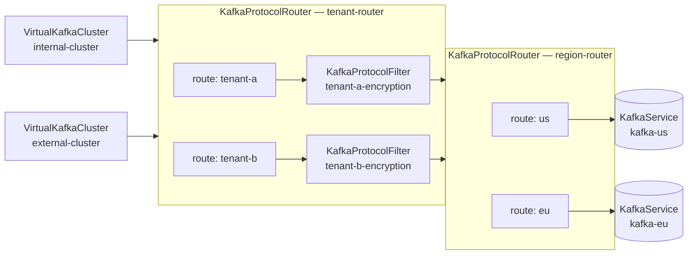

# 142 - Kubernetes CRD Changes for Routing API

The [routing API proposal (070)](070-routing-api.md) introduces Routers as top-level plugins that
direct client requests across multiple Kafka clusters via named Routes. This proposal specifies the
CRD schema changes needed so that the Kroxylicious Kubernetes operator can configure routing
declaratively. It addresses [kroxylicious/kroxylicious#4430](https://github.com/kroxylicious/kroxylicious/issues/4430).

## Current situation

The current operator API ([proposal 001](001-kroxylicious-operator-api-v1alpha.md)) defines a
`VirtualKafkaCluster` (VKC) that links a proxy, a set of ingresses, an ordered filter chain, and
**exactly one** upstream target via `targetKafkaServiceRef`:

```yaml
apiVersion: kroxylicious.io/v1alpha1
kind: VirtualKafkaCluster
metadata:
  name: my-cluster
spec:
  proxyRef:
    name: my-proxy
  targetKafkaServiceRef:
    name: upstream-kafka
  ingresses:
    - ingressRef:
        name: my-ingress
  filterRefs:
    - group: kroxylicious.io
      kind: KafkaProtocolFilter
      name: my-filter
```

There is no concept of a router or multi-cluster routing in the CRD model. Each VKC maps to a
single `KafkaService`.

## Motivation

Routing API proposal 070 enables a single VKC to fan traffic across multiple upstream `KafkaService`
instances, with per-route filter chains and optional router chaining (forming a DAG). The CRDs must
express this structure so that the operator can generate the corresponding `RouterDefinition` and
`RouteDefinition` entries in the proxy configuration.

Specific capabilities that require CRD support:

- Associating a VKC with a router rather than a single `KafkaService`
- Declaring named routes within a router, each with its own filter chain and upstream target
- Supporting router chaining (a route's target can be another router)
- Sharing a router graph across multiple VKCs so that a common routing definition does not need
  to be duplicated per virtual cluster
- Stable node-ID mapping across restarts and YAML reordering
- Reporting cycles in the router DAG as conditions on the affected resources

## Out of scope

- **`KroxyliciousSidecarConfig`** — the sidecar injection admission webhook and its configuration
  resource are not extended to support router configuration. This is deferred to a separate proposal.

## Proposal

### New CRD: `KafkaProtocolRouter`

A `KafkaProtocolRouter` is a namespace-scoped resource that declares a router plugin and its
routes. It follows the same pattern as `KafkaProtocolFilter` (standalone, reusable, no
`proxyRef`). Multiple VKCs in the same namespace can reference the same router.

All examples in this proposal use `io.kroxylicious.proxy.router.HeaderBasedRouter` as the router
`type`. This is a hypothetical router used for illustration only.

```yaml
apiVersion: kroxylicious.io/v1alpha1
kind: KafkaProtocolRouter
metadata:
  name: tenant-router
spec:
  type: io.kroxylicious.proxy.router.HeaderBasedRouter  # passed opaquely to the proxy; resolved by the proxy runtime (FQCN or unambiguous simple name)
  configTemplate:                                       # router-specific config; supports secret/configmap interpolation e.g. ${secret:my-secret:key}
    headerName: X-Tenant-Id
  routes:
    - name: tenant-a
      id: 0
      filterRefs:
        - group: kroxylicious.io
          kind: KafkaProtocolFilter
          name: tenant-a-encryption
      targetRef:
        group: kroxylicious.io
        kind: KafkaService
        name: kafka-cluster-a
    - name: tenant-b
      id: 1
      targetRef:
        group: kroxylicious.io
        kind: KafkaService
        name: kafka-cluster-b
```

#### Route fields

| Field | Type | Required | Description |
|---|---|---|---|
| `name` | string | yes | Human-readable name; used as the route name in `RouteDefinition` |
| `id` | integer | yes | Stable zero-based identifier within this router; used in the node-ID mapping formula |
| `filterRefs` | list | no | Ordered list of `KafkaProtocolFilter` references applied on this route |
| `targetRef` | object | yes | Upstream target — either a `KafkaService` or a `KafkaProtocolRouter` |

#### Route `targetRef`

`targetRef` is a typed cross-namespace reference using `group`, `kind`, and `name`. Only two
`kind` values are valid:

- `KafkaService` — leaf target, maps to a `clusterDefinition` entry in the proxy config
- `KafkaProtocolRouter` — chains to another router, enabling nested routing DAGs

A CEL validation rule in the CRD schema enforces that `targetRef.kind` is one of these two values.

#### Route `id` and node-ID mapping

The routing API uses the formula:

```
virtualNodeId = route.id + (numberOfRoutes × targetBrokerNodeId)
```

Route `id` values MUST be:
- Non-negative integers
- Unique within the `KafkaProtocolRouter`
- Stable — reordering routes in the YAML MUST NOT change their `id` values

Implicit assignment (deriving `id` from list position) was considered and rejected; see
[Rejected alternatives](#rejected-alternatives).

Together these three constraints — non-negative, less than route count, and unique — guarantee that
`id` values form exactly the set `{0, 1, …, S-1}`, which is required for the node-ID mapping
formula to work correctly. They are enforced by CEL validation rules on the `routes` array in the
CRD schema:

```
# non-negative
self.routes.all(r, r.id >= 0)

# less than route count (no gaps)
self.routes.all(r, r.id < self.routes.size())

# unique within router
self.routes.all(r, self.routes.filter(s, s.id == r.id).size() == 1)
```

---

### Changes to `VirtualKafkaCluster`

#### New field: `targetRef`

A new optional field `targetRef` replaces the role of `targetKafkaServiceRef`. It accepts the same
discriminated union as a route's `targetRef` (`KafkaService` or `KafkaProtocolRouter`):

```yaml
spec:
  proxyRef:
    name: my-proxy
  targetRef:
    group: kroxylicious.io
    kind: KafkaProtocolRouter
    name: tenant-router
  ingresses:
    - ingressRef:
        name: my-ingress
  filterRefs:
    - group: kroxylicious.io
      kind: KafkaProtocolFilter
      name: global-audit-filter
```

#### Deprecation of `targetKafkaServiceRef`

`targetKafkaServiceRef` is deprecated. It continues to function — the operator treats it as
shorthand for `targetRef: {group: kroxylicious.io, kind: KafkaService, name: <same-name>}`.

The field MUST be marked `deprecated: true` in the CRD OpenAPI schema, with a `description`
pointing to the replacement:

```yaml
targetKafkaServiceRef:
  deprecated: true
  description: "Deprecated: use spec.targetRef instead."
```

This surfaces the deprecation in `kubectl explain` and in IDE and linting tooling that consumes
the OpenAPI schema. It complements the runtime signal below, which covers the case where a user
applies a manifest without consulting the schema documentation.

When a VKC uses the deprecated field, the operator MUST also set a condition on the VKC:

```
type:    DeprecationWarning
status:  "True"
reason:  TargetKafkaServiceRefDeprecated
message: "spec.targetKafkaServiceRef is deprecated; migrate to spec.targetRef"
```

The `DeprecationWarning` type is defined in `io.kroxylicious.kubernetes.api.common.Condition.Type`.

#### Validation

The mutual exclusion of `targetRef` and `targetKafkaServiceRef` is expressed as a `oneOf`
constraint in the CRD OpenAPI schema, requiring exactly one of the two fields to be present.

---

### Router graph reuse

Because `KafkaProtocolRouter` is a standalone namespace-scoped resource rather than being inlined
in a VKC or another router, references to it are by identity — the same router, and transitively
its entire sub-graph, can be referenced from multiple places.

**Full graph reuse across VKCs.** Multiple `VirtualKafkaCluster` resources can reference the
same top-level `KafkaProtocolRouter`. They share the entire router graph identically — all routes,
nested routers, per-route filter chains, and leaf `KafkaService` targets. The complete example
below shows `internal-cluster` and `external-cluster` sharing `tenant-router` in this way.

**Sub-graph sharing between routers.** A route's `targetRef` can name a `KafkaProtocolRouter`
that is itself referenced by other routers. In the complete example, both the `tenant-a` and
`tenant-b` routes inside `tenant-router` target the same `region-router` — that sub-graph is
shared across both routes and does not need to be duplicated. The same pattern applies across
separate top-level routers: a common downstream tier can be declared once and referenced by any
number of parent routers.

**No parameterization or override.** References are by identity only. There is no mechanism to
instantiate a router with different parameters or to substitute a different `KafkaService` at a
leaf. Operators who need the same routing topology with environment- or tenant-specific leaf
targets require separate KPR hierarchies for the parts that differ, and should use configuration
templating tooling such as Kustomize or Helm to generate them.

---

### Operator-side cycle detection

The proxy runtime (operand) already detects cycles in the router DAG and refuses to start with a
cyclic configuration. However, there is no back channel from the operand to the operator that
would allow a runtime-detected cycle to be surfaced as a condition on a Kubernetes resource.

The simplest solution is for the operator to independently implement the same cycle detection
business rule during reconciliation of a `KafkaProxy`. When the operator resolves the router
graph reachable from a VKC's `targetRef`, it performs a depth-first traversal and detects any
back-edges. A VKC whose resolved graph contains a cycle is marked with `Accepted: False` (see
[Status conditions](#status-conditions) below) and is not deployed. This gives the user a clear,
actionable signal at the API layer without requiring any communication from the running proxy.

---

### Status conditions

#### On `KafkaProtocolRouter`

`KafkaProtocolRouter` follows the same condition pattern as `KafkaProtocolFilter`. Because a router
is not uniquely associated with a single `KafkaProxy`, the operator cannot set an `Accepted`
condition on it. Instead, the router's own reconciler sets a single `ResolvedRefs` condition
reflecting whether all resources directly referenced by the router exist:

- Route `targetRef` resources (`KafkaService` or `KafkaProtocolRouter`)
- Route `filterRefs` resources (`KafkaProtocolFilter`)
- Secrets and ConfigMaps interpolated in `configTemplate`

```
type:    ResolvedRefs
status:  "True"
reason:  (omitted when True)
message: (omitted when True)
```

```
type:    ResolvedRefs
status:  "False"
reason:  ReferencedResourcesNotFound          # route targetRef or filterRef missing
                                              # (or: InterpolatedReferencedResourcesNotFound for configTemplate Secrets/ConfigMaps)
message: "<human-readable explanation>"
```

`ResolvedRefs: True` does not imply the router graph is cycle-free — transitive cycle
detection only occurs during VKC reconciliation and is reported there (see below).

#### On `VirtualKafkaCluster` — cycle in the router DAG

The operator resolves router references transitively when reconciling a `KafkaProxy`. If a cycle
is detected in the router DAG reachable from a VKC's `targetRef`, the VKC MUST be marked:

```
type:    Accepted
status:  "False"
reason:  RouterDAGCycle
message: "Router graph contains a cycle: tenant-router → sub-router → tenant-router"
```

A VKC in this state is not deployed.

#### On `VirtualKafkaCluster` — unresolvable target

If a `targetRef` (or a router it references transitively) cannot be resolved (not found or wrong
kind), the VKC MUST be marked:

```
type:    ResolvedRefs
status:  "False"
reason:  TargetNotFound
message: "<human-readable explanation>"
```

---

### Complete example: multi-tenant regional routing

This example shows a two-level routing DAG. A `tenant-router` first selects a per-tenant
route (each with its own encryption filter); both routes then delegate to a shared `region-router`
that directs traffic to the nearest Kafka cluster. Two VKCs share the entire graph.



```yaml
# Regional upstream clusters
apiVersion: kroxylicious.io/v1alpha1
kind: KafkaService
metadata:
  name: kafka-us
spec:
  bootstrapServers: kafka-us.internal:9092
---
apiVersion: kroxylicious.io/v1alpha1
kind: KafkaService
metadata:
  name: kafka-eu
spec:
  bootstrapServers: kafka-eu.internal:9092
---
# Region router: shared sub-graph used by every tenant route
apiVersion: kroxylicious.io/v1alpha1
kind: KafkaProtocolRouter
metadata:
  name: region-router
spec:
  type: io.kroxylicious.proxy.router.HeaderBasedRouter
  configTemplate:
    headerName: X-Region
  routes:
    - name: us
      id: 0
      targetRef:
        group: kroxylicious.io
        kind: KafkaService
        name: kafka-us
    - name: eu
      id: 1
      targetRef:
        group: kroxylicious.io
        kind: KafkaService
        name: kafka-eu
---
# Tenant router: selects a per-tenant encryption filter, then delegates to region-router
apiVersion: kroxylicious.io/v1alpha1
kind: KafkaProtocolRouter
metadata:
  name: tenant-router
spec:
  type: io.kroxylicious.proxy.router.HeaderBasedRouter
  configTemplate:
    headerName: X-Tenant-Id
  routes:
    - name: tenant-a
      id: 0
      filterRefs:
        - group: kroxylicious.io
          kind: KafkaProtocolFilter
          name: tenant-a-encryption
      targetRef:
        group: kroxylicious.io
        kind: KafkaProtocolRouter
        name: region-router
    - name: tenant-b
      id: 1
      filterRefs:
        - group: kroxylicious.io
          kind: KafkaProtocolFilter
          name: tenant-b-encryption
      targetRef:
        group: kroxylicious.io
        kind: KafkaProtocolRouter
        name: region-router
---
# Two VKCs sharing the same tenant-router graph
apiVersion: kroxylicious.io/v1alpha1
kind: VirtualKafkaCluster
metadata:
  name: internal-cluster
spec:
  proxyRef:
    name: my-proxy
  targetRef:
    group: kroxylicious.io
    kind: KafkaProtocolRouter
    name: tenant-router
  ingresses:
    - ingressRef:
        name: internal-ingress
---
apiVersion: kroxylicious.io/v1alpha1
kind: VirtualKafkaCluster
metadata:
  name: external-cluster
spec:
  proxyRef:
    name: my-proxy
  targetRef:
    group: kroxylicious.io
    kind: KafkaProtocolRouter
    name: tenant-router
  ingresses:
    - ingressRef:
        name: external-ingress
```

---

### Operator reconciliation sketch

The proposal covers CRD schema only; reconciler implementation is out of scope. At a high level,
reconciliation of a `KafkaProxy` must:

1. Resolve all `VirtualKafkaCluster` resources associated with the proxy
2. For each VKC, follow `targetRef` transitively, collecting the set of reachable
   `KafkaProtocolRouter` and `KafkaService` resources
3. Detect cycles in the resulting DAG and set conditions accordingly
4. Generate `routerDefinitions`, `clusterDefinitions`, and the VKC `target` in the proxy config
   from the resolved graph

## Affected/not affected projects

| Project | Affected |
|---|---|
| `kroxylicious-kubernetes/kroxylicious-kubernetes-api` | Yes — new `KafkaProtocolRouter` CRD; changes to `VirtualKafkaCluster` spec |
| `kroxylicious-kubernetes/kroxylicious-operator` | Yes — reconciler must resolve router refs, detect cycles, generate config |
| `kroxylicious-kubernetes/kroxylicious-admission` | No — out of scope; see [Out of scope](#out-of-scope) |
| `kroxylicious-api` | No — router SPI unchanged |
| `kroxylicious-runtime` | No — `RouterDefinition`/`RouteDefinition` model unchanged |
| `kroxylicious-filters` | No |
| `kroxylicious-kms` | No |
| `kroxylicious-docs` | Yes — operator user guide needs updating |

## Compatibility

### Backwards compatibility

Existing `VirtualKafkaCluster` resources using `targetKafkaServiceRef` continue to work without
change. The operator will emit a deprecation condition but will not break existing deployments.
No timeline for removing `targetKafkaServiceRef` is set by this proposal; a separate deprecation
notice will govern its removal.

### Forward compatibility

`KafkaProtocolRouter` is introduced at `v1alpha1`, consistent with the rest of the operator API.
Breaking changes to its schema require the usual alpha→beta→GA graduation process defined in
proposal 001.

Route `id` values are explicitly assigned to decouple virtual node-ID assignments from YAML
ordering. This means adding a new route at any position in the list does not invalidate
node-ID assignments for existing routes, provided existing route `id` values are not changed.
Changing a route's `id` or removing a route changes the effective `numberOfRoutes` value used
in the mapping formula and invalidates existing node-ID assignments — clients will need to
reconnect (the routing proposal describes this as requiring connection draining).

## Rejected alternatives

### Implicit route IDs derived from list position

Making `id` implicit (i.e., `id = index in routes list`) was considered for simplicity. It was
rejected because reordering routes in the YAML silently changes the node-ID mapping formula,
potentially reassigning virtual broker node IDs across restarts or configuration updates. This
would force client reconnections unexpectedly. Explicit `id` values make this change intentional
and reviewable in a diff.

### Inline router configuration in `VirtualKafkaCluster`

Embedding the router spec directly inside the VKC spec was considered. It was rejected because:

- A router cannot be shared across multiple VKCs
- The VKC spec becomes large and hard to review
- Consistency with `KafkaProtocolFilter` — which is a standalone CRD — argues for the same
  pattern for routers

### Replacing `targetKafkaServiceRef` with a discriminated `targetRef` only (no deprecation path)

Replacing the existing field outright (rather than deprecating it alongside the new field) would
be a breaking schema change for existing users. The deprecation-with-condition approach preserves
backward compatibility while clearly signalling the migration path.

### Separate `KafkaProxyRoute` CRD per route

Making each route a standalone CRD (referenced from `KafkaProtocolRouter`) was considered for
maximum RBAC granularity. It was rejected because routes have no meaningful independent lifecycle
— they are always created, updated, and deleted together with their router — and the additional
resource count adds operational overhead without proportionate benefit.

### Router graph parameterization and override

The reuse model described in this proposal allows verbatim sharing of router graphs but provides
no mechanism for instantiating the same topology with different leaf `KafkaService` targets. Three
approaches to solving this were considered and rejected.

Mature Kubernetes projects that have tackled the analogous problem are instructive. Cluster API's
[ClusterClass](https://cluster-api.sigs.k8s.io/tasks/experimental-features/cluster-class/) solves
"same cluster topology, different cloud infrastructure" by declaring typed variables in the
`ClusterClass` and mapping them to fields in composed template resources via RFC 6902 JSON Patch
path strings (e.g. `/spec/template/spec/.../imageRepository`). Consumers supply values without
knowing the patch targets, but the template author must hardcode string paths into each composed
resource's internal structure — coupling does not disappear, it moves to the template author.
[Crossplane Compositions](https://docs.crossplane.io/latest/concepts/compositions/) take a similar
approach: a `CompositeResourceDefinition` exposes a typed user-facing API and a `Composition` maps
fields from it into managed resources using dot-notation path strings. Their newer Pipeline mode
ultimately abandoned declarative patch strings entirely in favour of KRM Functions (containerised
Go or CEL programs that receive a set of Kubernetes resources, transform them arbitrarily, and
return the result — essentially arbitrary code in a Kubernetes-shaped wrapper). The lesson from both projects is that any CRD-native parameterization mechanism must
eventually address substitution targets, which requires either field path strings (coupling the
template author to internal resource structure) or a full composition/function framework. Neither
is a lightweight addition, and both took those projects years to stabilise.

#### Template CRD with typed parameters

Introduce a `KafkaProtocolRouterTemplate` CRD that declares typed parameters, and allow a
`KafkaProtocolRouter` to instantiate a template with concrete values:

```yaml
kind: KafkaProtocolRouterTemplate
spec:
  parameters:
    - name: usCluster
      type: KafkaServiceRef
    - name: euCluster
      type: KafkaServiceRef
  template:
    type: io.kroxylicious.proxy.router.HeaderBasedRouter
    routes:
      - name: us
        id: 0
        targetRef: ${usCluster}
      - name: eu
        id: 1
        targetRef: ${euCluster}
---
kind: KafkaProtocolRouter
metadata:
  name: tenant-a-region-router
spec:
  templateRef:
    name: regional-router-template
  values:
    usCluster: { group: kroxylicious.io, kind: KafkaService, name: tenant-a-kafka-us }
    euCluster: { group: kroxylicious.io, kind: KafkaService, name: tenant-a-kafka-eu }
```

Rejected for several compounding reasons.

First, CEL validation rules (route `id` uniqueness and contiguity) must be evaluated against the
materialised graph, not the template, so schema validation requires a materialisation step before
it can run.

Second, to implement this cleanly — without collapsing two distinct jobs into one reconciler —
requires a dedicated template-instantiation controller whose only job is watching
`KafkaProtocolRouterTemplate` resources and stamping out concrete `KafkaProtocolRouter` instances
as owned child resources. The existing KPR reconciler then sees only normal KPRs, as CAPI's
infrastructure controllers see only concrete infrastructure resources. This clean two-layer
separation is exactly how ClusterClass avoids a mixed-concern reconciler. However, it means
building an entirely separate controller with its own event sources, ownership model, and error
reporting before the routing feature itself can land.

The alternative — making the existing KPR reconciler also resolve templates — creates a
mixed-concern reconciler that the Java Operator SDK's design works against. JOSDK is built around
one reconciler, one primary resource, one set of secondary event sources. Grafting template
resolution into the reconciler entangles the event source dependency graph, complicates error
condition reporting (`ResolvedRefs: False` — because the template was not found, or because a
`KafkaService` was not found?), and produces a reconciler with two fundamentally different code
paths behind a conditional. This goes against the grain of the framework.

Third, RBAC gains a new "who may instantiate which template" dimension with no obvious answer.

#### KafkaService substitution map at the VKC level

Allow a `VirtualKafkaCluster` to supply substitutions when referencing a router, replacing named
`KafkaService` leaf targets across the entire resolved graph:

```yaml
kind: VirtualKafkaCluster
spec:
  targetRef:
    group: kroxylicious.io
    kind: KafkaProtocolRouter
    name: region-router
  kafkaServiceOverrides:
    - from: kafka-us
      to:   tenant-a-kafka-us
    - from: kafka-eu
      to:   tenant-a-kafka-eu
```

This is the most bounded variant — overrides are limited to leaf `KafkaService` substitution and
require no new CRD. It was rejected because it couples the VKC to knowledge of the internal
structure of the referenced KPR (route names, service names), so renaming a route or a service
in the KPR silently breaks any VKC that declares an override for it. The encapsulation that makes
standalone KPRs reusable would be undermined.

#### KafkaProtocolRouter inheritance

Allow a KPR to extend another, overriding specific routes:

```yaml
kind: KafkaProtocolRouter
metadata:
  name: tenant-a-region-router
spec:
  extends:
    name: region-router
  routeOverrides:
    - name: us
      targetRef: { group: kroxylicious.io, kind: KafkaService, name: tenant-a-kafka-us }
    - name: eu
      targetRef: { group: kroxylicious.io, kind: KafkaService, name: tenant-a-kafka-eu }
```

Rejected because inheritance chains are hard to reason about operationally; the `id` stability
invariant becomes fragile when the base router gains or loses routes; and the "effective"
configuration of an extending router cannot be understood without resolving the full inheritance
chain, which complicates both debugging and reconciler implementation.

**Common reasons across all three approaches.** Each approach requires the reconciler to
materialise a merged or substituted graph before it can validate or act on it. Cycle detection,
`id` validation, and condition reporting all become more complex. The real-world evidence from
ClusterClass and Crossplane shows that this complexity does not reduce over time — it grows as
edge cases emerge, and both projects took years to stabilise their parameterization models.
Doing it cleanly — as CAPI does — requires a dedicated template-instantiation controller as a
separate layer; doing it in a single reconciler means fighting against the grain of the Java
Operator SDK's one-reconciler-one-job model. Configuration templating tools such as Kustomize
or Helm already solve the "same topology, different values" problem well and keep that complexity
outside the operator, where it is separable, testable, and familiar to Kubernetes operators.
This proposal defers to those tools rather than reimplementing a subset of what other projects
took years to get right.
